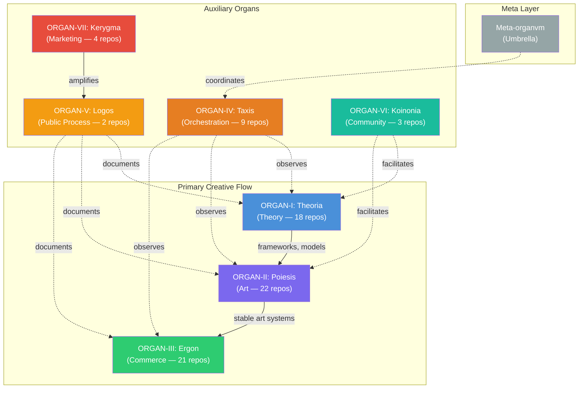
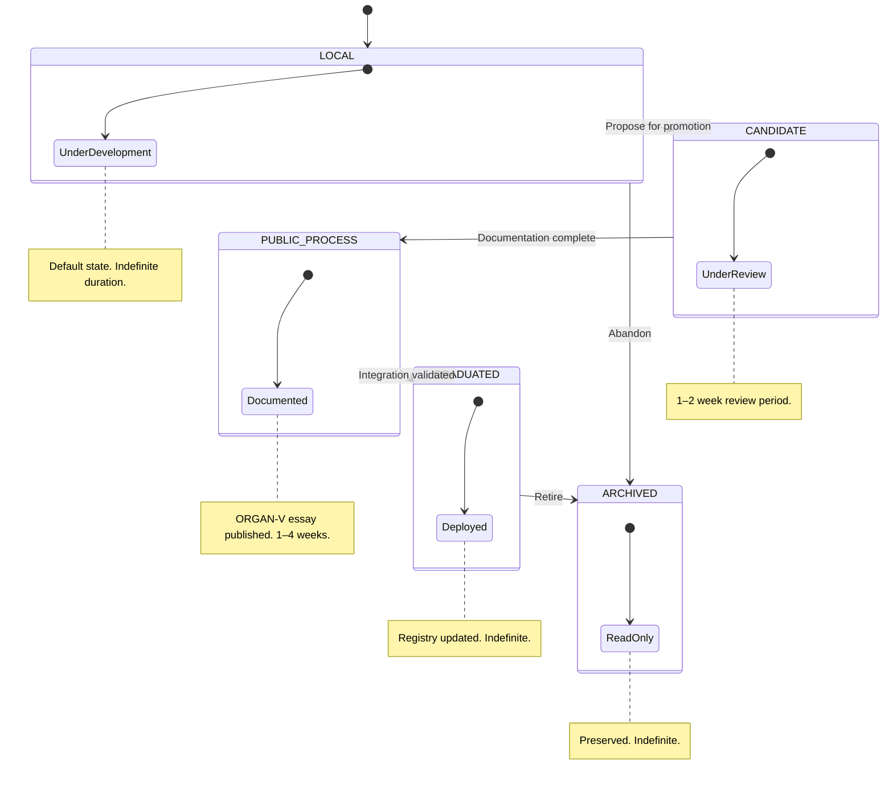

# How We Orchestrate Eight Organs Across 79 Repositories

## The Problem No One Warns You About

There is a moment in any sustained creative practice when the work outgrows the person doing it. Not in ambition or ego, but in sheer structural complexity. You build a recursive engine for symbolic processing, and it needs a governance layer. You build the governance layer, and it needs a registry. You build the registry, and it needs validation workflows. You commercialize one of your art projects, and suddenly there are deployment pipelines, customer data, revenue tracking, and SLA documentation that must coexist alongside the theoretical papers and generative music experiments that started the whole thing.

I reached that moment sometime in late 2024. My personal GitHub account held dozens of repositories spanning epistemological frameworks, generative art engines, SaaS products, AI agent architectures, and what I can only describe as alchemical computing experiments. Some of these repos had comprehensive documentation; most did not. Some had test suites; others were sketches and seeds. The work was real, but the organization was not. A grant reviewer clicking through my profile would have encountered a wall of cryptic repository names with no discernible logic connecting them. A hiring manager would have seen chaos.

The problem was not quality. Individual projects were substantial. `recursive-engine--generative-entity` had 1,254 tests and 85% coverage. `public-record-data-scrapper` was live on Vercel with paying subscribers and 2,055 tests across a 50-state data collection pipeline. `agentic-titan` implemented six distinct agent topologies with 1,095 adversarial, chaos, integration, and end-to-end tests across 18 completed development phases. These were not weekend experiments. They were production systems built over years of sustained effort[^1].

The problem was coherence. Without a visible structure connecting theory to art to commerce, each repository existed in isolation. The intellectual throughline — that recursive epistemological frameworks could generate art, and that art could become viable commercial products — was invisible. The system existed in my head but not in any artifact a stranger could navigate. Herbert Simon called this the problem of "near decomposability" — complex systems whose components interact richly internally but whose inter-component relationships remain opaque without deliberate architectural effort[^2].

I needed infrastructure. Not a monorepo, not a project management tool, not a Notion database. I needed an organizational architecture that could hold the full range of creative-institutional work — from Aristotelian ontology to UCC records scraping — and make the relationships between those things legible. I needed something that would work for years, not months. Something that could grow without collapsing under its own weight[^3].

What I built is an eight-organ system coordinating 79 repositories across 8 GitHub organizations. This essay describes how it works, why it is structured the way it is, and what it enables for sustained autonomous creative practice.

---

## The Eight-Organ Model

The system is organized into eight organs, each named with a Greek ontological suffix that describes its function. The naming is not decorative. These terms carry millennia of philosophical weight, and using them forces a precision that English corporate vocabulary ("team," "division," "department") does not. Each organ maps to a distinct GitHub organization with its own repositories, documentation standards, and governance rules.

### ORGAN-I: Theoria (Theory)

*From the Greek theoria (contemplation, systematic observation) — the practice of understanding the world through sustained intellectual inquiry.*

ORGAN-I holds 18 repositories dedicated to epistemological frameworks, recursive engines, ontological systems, and conceptual research. This is where first principles live. The flagship, `recursive-engine--generative-entity`, is a symbolic operating system for myth, identity, ritual, and recursive systems. It implements 21 organ handlers, a ritual syntax DSL, workflow orchestration, and external bridges to Obsidian, Git, and Max/MSP. It is pure Python, 1,254 tests, 85% coverage.

But ORGAN-I is not a single project. It is a research organ. `narratological-algorithmic-lenses` formalizes narrative principles from Aristotle to Pixar as 92 executable algorithms across 14 narratological studies. `call-function--ontological` builds an ontological function-calling framework grounded in Heideggerian Dasein, Aristotelian four causes, and Peircean semiotics. `nexus--babel-alexandria-` is a 50,000-word design document for a nine-layer rhetorical-linguistic operating system built on category theory. `sema-metra--alchemica-mundi` maps 22 classical alchemical operations (Nigredo through Rubedo) onto computational semantics through distillation, fermentation, and projection engines[^4].

Each repository in ORGAN-I addresses a different facet of the same underlying question: how do you formalize human meaning-making processes in ways that machines can execute? The answer is not a single framework but a constellation of interlocking approaches — narratological, ontological, semiotic, alchemical — that reinforce and challenge each other.

### ORGAN-II: Poiesis (Art)

*From the Greek poiesis (making, bringing-forth) — the act of creating something that did not exist before.*

ORGAN-II contains 22 repositories for generative art, interactive systems, performance frameworks, and experiential work. Where ORGAN-I theorizes, ORGAN-II instantiates. The flagship is `metasystem-master`, the Omni-Dromenon Engine — a canonical monorepo consolidating 12 previously separate repos into a unified real-time performance system. It includes a core engine, performance SDK, client SDK, audio synthesis bridge, an `orchestrate` CLI, four example applications, and extensive documentation. At 5,078 words, its README alone constitutes a design document.

The organ also includes `a-mavs-olevm`, a personal artistic portfolio site; `a-i-council--coliseum`, a decentralized live-streaming platform where AI agents debate with viewer crypto participation; `artist-toolkit-and-templates`, a collection of artist prospecting playbooks, grant resources, and project templates; and `client-sdk`, a WebSocket client library for audience vote submission. Several example applications — generative music, choreographic interface, theatre dialogue, interactive installation — demonstrate specific artistic instantiations of the theoretical frameworks defined in ORGAN-I.

The relationship between ORGAN-I and ORGAN-II is not metaphorical. `metasystem-master` declares an explicit dependency on `organvm-i-theoria/recursive-engine--generative-entity`. Theory is imported as infrastructure[^5].

### ORGAN-III: Ergon (Commerce)

*From the Greek ergon (work, deed, accomplishment) — the tangible product of labor.*

ORGAN-III houses 21 repositories for revenue-generating products: SaaS platforms, B2B data tools, B2C consumer applications, and internal business systems. This is where ideas become economically viable. The flagship is `public-record-data-scrapper`, a 50-state UCC public records aggregation platform with a live Vercel deployment, tiered B2B subscriptions, Terraform AWS infrastructure, 60+ collection agents, and 2,055 tests. It generates active revenue.

The commercial portfolio extends across domains: `classroom-rpg-aetheria` (educational RPG, SaaS, active revenue), `gamified-coach-interface` (gamified coaching platform, SaaS), `trade-perpetual-future` (perpetual futures trading system, B2B), `fetch-familiar-friends` (social matching platform, B2C), `sovereign-ecosystem--real-estate-luxury` (luxury real estate marketplace with blockchain verification), `tab-bookmark-manager` (AI-powered bookmark management with ML services and browser extension), `the-actual-news` (verifiable news ledger, civic tech), `my-block-warfare` (TurfSynth AR, location-based game with procedural creature generation), and `life-my--midst--in` (an inverted-interview CV platform with 16 identity masks and W3C Verifiable Credentials).

Each ORGAN-III repository carries additional metadata in the registry: `type` (SaaS, B2B, B2C, internal) and `revenue` (active, planned, none). This is not vanity data. Grant reviewers at the Knight Foundation and Mellon Foundation explicitly evaluate organizational sustainability. Evidence of revenue generation demonstrates that the system sustains itself[^6].

### ORGAN-IV: Taxis (Orchestration)

*From the Greek taxis (order, arrangement, disposition) — the principle of structured organization.*

ORGAN-IV is the coordination layer. Its 9 repositories handle cross-organ routing, governance, promotion automation, system coordination, and dependency management. The flagship is `agentic-titan`, a Polymorphic Agent Swarm Architecture implementing a model-agnostic, self-organizing multi-agent system with 6 topologies (hierarchical, mesh, ring, star, tree, and hybrid), 1,095+ tests spanning adversarial, chaos, end-to-end, integration, performance, MCP, and Ray categories, across 18 completed development phases.

Supporting repos include `agent--claude-smith` (multi-agent orchestration using the Claude Agent SDK with subagent spawning, state persistence, and self-correction), `a-i--skills` (a public repository of AI agent skills across 12 categories), `petasum-super-petasum` (organization-wide issue tracking with logic-first governance), and `universal-node-network` (distributed node network infrastructure for decentralized systems).

ORGAN-IV is where the meta-system lives. The registry, governance rules, workflow specifications, and promotion criteria all originate here. It observes all other organs but no other organ depends on it — a deliberate architectural choice I will explain in the next section[^7].

### ORGAN-V: Logos (Public Process)

*From the Greek logos (speech, reason, account) — the articulation of meaning through language.*

ORGAN-V contains 2 repositories dedicated to essays, marginalia, process documentation, and building in public. The essay you are reading right now is an ORGAN-V artifact. The flagship is `public-process`, which houses the full essay series, case studies, methodology documentation, an RSS feed, and newsletter integration. Its README was deployed at 4,040 words during the Bronze Sprint.

ORGAN-V is the narrative layer. It converts the structural complexity of the other seven organs into prose that grant reviewers, hiring managers, and fellow practitioners can navigate. Every system decision, every governance rule, every architectural trade-off documented in ORGAN-IV becomes an essay topic in ORGAN-V.

### ORGAN-VI: Koinonia (Community)

*From the Greek koinonia (fellowship, communion, participation) — the shared life of a community.*

ORGAN-VI has 3 repositories for community infrastructure: salon archives, reading group curricula, and collaborative spaces. Participation is invitation-only. This organ is relevant for residency applications (Eyebeam, Somerset House, Processing Foundation) that evaluate community contribution and ecosystem participation.

### ORGAN-VII: Kerygma (Marketing)

*From the Greek kerygma (proclamation, public announcement) — the act of declaring something to the world.*

ORGAN-VII holds 4 repositories for POSSE (Publish on your Own Site, Syndicate Everywhere) distribution, social automation, announcement templates, and audience analytics. ORGAN-VII amplifies ORGAN-V content across Mastodon, LinkedIn, Discord, and newsletter channels.

### Meta-organvm: The Umbrella

Above all seven organs sits `meta-organvm`, the umbrella organization. It holds zero code repositories. Its function is coordination and visibility: cross-org governance, system-wide profile documentation, and a single entry point for anyone encountering the system for the first time.

<figure>

79

Repositories Tracked

8

GitHub Organizations

208K

Words of Documentation

4,400+

Automated Tests

24

Mapped Dependencies

7

Flagship READMEs

<figcaption>Figure 1. Eight-organ system metrics as of February 2026.</figcaption>
</figure>

---

## Unidirectional Dependencies: Why the Flow Only Goes One Way

The most important structural constraint in the eight-organ system is the prohibition on back-edges in the dependency graph. The primary creative flow moves in one direction only: **I to II to III**. Theory informs art. Art produces commerce products. Never the reverse.

This means ORGAN-III (Commerce) cannot depend on ORGAN-II (Art) output at runtime. If `public-record-data-scrapper` needs a data visualization, it cannot import a module from `metasystem-master`. It must either internalize that capability or use a third-party dependency. ORGAN-II cannot depend on ORGAN-III. If the Omni-Dromenon Engine needs a payment processor for ticketed performances, that integration lives in ORGAN-III, not ORGAN-II[^8].

The remaining organs have defined roles in this flow:
- **ORGAN-IV** orchestrates all organs but no organ depends on ORGAN-IV. It observes and coordinates without creating coupling.
- **ORGAN-V** documents all organs. It reads from everything but nothing reads from it. Documentation is a one-way mirror.
- **ORGAN-VI** facilitates collaboration across organs but creates no hard dependencies. Participation is opt-in.
- **ORGAN-VII** amplifies ORGAN-V content. It consumes published essays and distributes them; it does not generate original content.

Why does this constraint matter? Because bidirectional dependencies create cascading failures. If ORGAN-III depends on ORGAN-II, and ORGAN-II depends on ORGAN-I, then a breaking change in ORGAN-I can cascade through art systems and take down commercial products. Unidirectional flow means failures propagate in only one direction, and that direction is from theory (where breaking changes have the lowest immediate cost) toward commerce (where stability matters most). By the time an idea reaches ORGAN-III, it has been refined through theoretical formalization (ORGAN-I) and artistic instantiation (ORGAN-II). It has been tested, iterated, and stabilized. Donella Meadows observed that the most resilient systems are those where feedback loops are explicit and directional — "the information delivered by a feedback loop can only affect future behavior; it cannot deliver the information, and so cannot have an impact fast enough to correct behavior that drove the current feedback"[^9].

The constraint also enforces intellectual honesty about what depends on what. Theory should not need commerce to justify itself. Art should not need revenue to exist. Commerce should not need to import aesthetic frameworks to function. Each organ is autonomous within its domain. The connections between them are intentional, deliberate, and documented — not accidental couplings that emerge from convenience. As Melvin Conway argued in 1968, the structure of a system inevitably mirrors the communication structure of the organization that built it — a principle now known as Conway's Law[^10].

In practice, this means the dependency graph is a directed acyclic graph (DAG). The registry validates this constraint automatically. Any proposed dependency that creates a cycle or a back-edge is rejected before it can enter the system.

---

## The Registry as Single Source of Truth

At the center of the eight-organ system is `registry-v2.json`, a machine-readable file that contains the complete state of all 79 repositories. Every repo entry includes: `name`, `org`, `status`, `public`, `description`, `documentation_status`, `portfolio_relevance`, `dependencies`, `promotion_status`, `tier`, and `last_validated`. ORGAN-III repos additionally carry `type` (SaaS, B2B, B2C, internal) and `revenue` fields.

The registry is governed by a constitutional principle (Article I of the project constitution): "All repo state lives in `registry-v2.json`. The registry is never wrong; if reality and registry disagree, update the registry or fix reality. No document, workflow, or agent may claim authoritative repo state outside the registry."

This is not a philosophical statement. It is an operational constraint. When a GitHub Action validates system health, it reads from the registry. When an essay references a repository's test count or documentation status, the registry is the source. When a promotion proposal moves a repo from one organ to another, the registry records the transition. There is exactly one place where the truth about the system's state is recorded, and every other artifact in the system derives from it. Elinor Ostrom's research on institutional governance demonstrated that successful commons management depends on clearly defined boundaries and rules that are matched to local conditions — the registry embodies this principle as a computational artifact[^11].

The current registry reflects the system as of February 2026: 79 total entries (64 on GitHub, 15 planned but not yet created), distributed across I=18, II=22, III=21, IV=9, V=2, VI=3, VII=4. The summary field records: "Silver Sprint COMPLETE 2026-02-10 — all 58 non-infrastructure repo READMEs deployed at 2,000+ words, 7 flagships, all 8 org profiles expanded (~5.7K profile words)." Total documentation effort: approximately 208,000 words across 58 repos and 8 organizational profiles.

The registry also encodes portfolio relevance scores. Each repo is rated CRITICAL, HIGH, MEDIUM, LOW, INTERNAL, OPTIONAL, or NONE. This scoring is not internal bookkeeping. It determines what surfaces first when a Knight Foundation reviewer or an Anthropic hiring manager navigates the system. CRITICAL repos (recursive-engine, metasystem-master, public-record-data-scrapper, agentic-titan, public-process) are the flagships. They received the most documentation investment, the longest READMEs, and the earliest deployment during the Bronze Sprint.

The registry is versioned (currently v2.0, schema v0.2) and carries a schema note documenting which fields are populated and which remain Phase 3 deliverables. It is honest about its own incompleteness. Fields like `relationships.depends_on/consumed_by`, `promoted_to`, `audit_history[]`, `governance-rules.json`, `analytics.json`, and `.meta/dependencies.json` are explicitly listed as future work. The registry describes not just what the system is, but what it intends to become.

---

## The Promotion State Machine

Repositories in the eight-organ system follow a formal promotion pathway:

Each state has a precise meaning:

- **LOCAL**: Under development within its source organ. Not proposed for promotion. Duration: indefinite. This is the default state for most repositories.
- **CANDIDATE**: Proposed for cross-organ promotion and under review. The repo has been flagged (via a `ready-for-implementation` or `ready-for-commercialization` label) as suitable for movement to another organ. Duration: 1-2 weeks.
- **PUBLIC_PROCESS**: Documented via ORGAN-V and publicly visible. The repo's promotion has been written about as part of the public process series. It exists simultaneously in its source organ and as an ORGAN-V narrative artifact. Duration: 1-4 weeks.
- **GRADUATED**: Successfully promoted to its destination organ. The transition is complete, the registry is updated, and the repo now lives in its new organizational home. Duration: indefinite.
- **ARCHIVED**: No longer actively maintained. Preserved as read-only in its original organization. Duration: indefinite.

This state machine governs cross-organ promotion — that is, the movement of a repo from one organ to another. It does not describe day-to-day repo status. For that, the registry uses a separate vocabulary: `ACTIVE` (maintained, under development), `DEPLOYED` (in production, serving users), `SKELETON` (minimal structure, no substantive content), and `EMPTY` (created but nothing meaningful).

The distinction between these two vocabularies is important. A repo can be `ACTIVE` in its documentation status and `LOCAL` in its promotion status — meaning it is being actively developed but has not been proposed for movement to another organ. Conversely, a repo can be `DEPLOYED` and `PUBLIC_PROCESS` — meaning it is live in production and currently being documented as part of a public essay about its journey across organs[^12].

Consider a concrete example. `recursive-engine--generative-entity` began as a personal project on the `4444J99` GitHub account. During Phase -1 (February 2026), it was transferred to `organvm-i-theoria`. Its promotion status moved to `PUBLIC_PROCESS` after its flagship README was deployed and it became a central subject of the ORGAN-V essay series. Its documentation status is `FLAGSHIP README DEPLOYED`. It is simultaneously the definitive ORGAN-I expression and a narrative artifact being documented publicly. Should a future art project in ORGAN-II build directly on its symbolic processing capabilities, the promotion state machine would track that transition from `PUBLIC_PROCESS` to `GRADUATED` in ORGAN-II, with the registry recording the full provenance chain.

No state may be skipped. A repository cannot jump from `LOCAL` to `GRADUATED`. It must pass through `CANDIDATE` (review) and `PUBLIC_PROCESS` (documentation) first. This enforces the constitutional principle that documentation precedes deployment: nothing moves between organs without being written about. The state machine is also a transparency mechanism. Because every promotion passes through `PUBLIC_PROCESS`, the ORGAN-V essay archive contains a complete narrative history of every cross-organ transition — when it happened, why it was proposed, what criteria it met, and what it produced. The system's institutional memory is not stored in someone's head or in a meeting note. It is published prose[^13].

---

## Concrete Examples: What the System Looks Like in Practice

Abstract architecture diagrams are easy to draw and difficult to trust. The eight-organ system earns its credibility through the specificity of its repositories. Here are four flagships, one from each of the primary organs.

<figure>
<table>
<thead><tr><th>Flagship</th><th>Organ</th><th>Tests</th><th>README</th><th>Key Capability</th></tr></thead>
<tbody>
<tr><td><code>recursive-engine--generative-entity</code></td><td>I (Theoria)</td><td>1,254</td><td>3,738w</td><td>Symbolic OS for myth, identity, ritual</td></tr>
<tr><td><code>metasystem-master</code></td><td>II (Poiesis)</td><td>—</td><td>5,078w</td><td>Omni-Dromenon real-time performance engine</td></tr>
<tr><td><code>public-record-data-scrapper</code></td><td>III (Ergon)</td><td>2,055</td><td>4,455w</td><td>50-state UCC records, live revenue</td></tr>
<tr><td><code>agentic-titan</code></td><td>IV (Taxis)</td><td>1,095+</td><td>4,678w</td><td>6-topology polymorphic agent swarm</td></tr>
</tbody>
</table>
<figcaption>Table 1. Four primary flagship repositories with test coverage and documentation metrics.</figcaption>
</figure>

### recursive-engine--generative-entity (ORGAN-I)

RE:GE is a symbolic operating system for myth, identity, ritual, and recursive systems. It is the theoretical foundation of the entire eight-organ system. The architecture implements 21 organ handlers — each corresponding to a distinct processing domain (perception, memory, transformation, synthesis, and so on) — orchestrated through a ritual syntax DSL that allows users to define symbolic workflows as structured ceremonies. Input symbols are ingested, processed through a pipeline of organ handlers, and emitted as transformed symbolic output.

The system bridges to external tools: Obsidian for knowledge management, Git for version-controlled symbolic state, and Max/MSP for real-time audio synthesis driven by symbolic transformations. The test suite contains 1,254 tests with 85% coverage, written entirely in Python. The README was deployed at 3,738 words and scored 96/100 on the project's internal documentation rubric.

RE:GE is not an application. It is an epistemological framework expressed as executable code. It asks: what happens when you treat myth, ritual, and identity not as cultural artifacts to be studied but as computational processes to be executed? The answer is a system that generates symbolic transformations according to formal rules — a recursive engine that produces generative entities. Gregory Bateson's concept of "the pattern which connects" — the meta-pattern that links living systems across scales — is precisely the kind of recursive structure that RE:GE formalizes computationally[^14].

### metasystem-master (ORGAN-II)

The Omni-Dromenon Engine is ORGAN-II's canonical monorepo, consolidating 12 previously separate repositories into a unified real-time performance system. The name derives from the Greek dromenon (a thing enacted, a ritual performed) — the artistic counterpart to ORGAN-I's theoretical frameworks.

The monorepo contains: `core-engine` (the central generative art engine), `performance-sdk` (a toolkit for real-time performance systems), `client-sdk` (a WebSocket client for audience participation), `audio-synthesis-bridge` (a TypeScript bridge connecting to OSC and WebAudio), the `orchestrate` CLI (a command-line tool for managing performance sessions), four example applications (generative music, choreographic interface, theatre dialogue, interactive installation), and comprehensive documentation.

The consolidation from 12 repos to one was itself an architectural decision documented in the governance system. Multiple independent repos created maintenance overhead, inconsistent versioning, and fragmented documentation. The monorepo preserves each component's independence (they can be imported separately) while providing a single entry point, unified test suite, and coherent documentation. The README was deployed at 5,078 words — the longest in the system, reflecting the monorepo's role as ORGAN-II's definitive expression.

`metasystem-master` declares an explicit dependency on `organvm-i-theoria/recursive-engine--generative-entity`. This is the I-to-II dependency in action: theoretical frameworks from ORGAN-I are imported as infrastructure for artistic production in ORGAN-II.

### public-record-data-scrapper (ORGAN-III)

This is the strongest revenue proof point in the system. It is a 50-state UCC (Uniform Commercial Code) public records aggregation platform serving B2B subscribers through a live Vercel deployment. The technical architecture includes 60+ collection agents (one per state filing office, with redundancy for high-volume jurisdictions), Terraform-managed AWS infrastructure, tiered subscription pricing, automated data quality validation, and 2,055 tests covering collection, parsing, storage, API, and integration layers.

The product addresses a concrete market need: businesses require access to UCC filing records for due diligence, lien searches, and compliance verification. State filing offices publish this data through inconsistent, poorly documented interfaces. `public-record-data-scrapper` normalizes 50 different data formats into a unified API, handles rate limiting and anti-scraping countermeasures, and delivers clean, structured data to subscribers.

Its README was deployed at 4,455 words. Its promotion status is `PUBLIC_PROCESS` — it is currently being documented as part of the ORGAN-V essay series on sustained commerce. It demonstrates that the eight-organ system is not an abstract governance exercise. Real products generate real revenue for real customers.

### agentic-titan (ORGAN-IV)

The Polymorphic Agent Swarm Architecture is the system's most technically ambitious project. It implements a model-agnostic, self-organizing multi-agent system supporting six distinct topologies: hierarchical (tree-structured delegation), mesh (peer-to-peer coordination), ring (sequential processing with feedback), star (centralized dispatch), tree (branching specialization), and hybrid (dynamic topology switching based on task characteristics).

The test suite contains 1,095+ tests spanning adversarial scenarios (agents attempting to subvert coordination protocols), chaos engineering (random infrastructure failures during multi-agent tasks), end-to-end integration, performance benchmarking, MCP (Model Context Protocol) compliance, and Ray distributed computing validation. Development has progressed through 18 completed phases, from initial architecture through topology implementation, fault tolerance, and production hardening.

`agentic-titan` depends on `organvm-i-theoria/recursive-engine--generative-entity` — the symbolic processing framework provides the foundation for agent identity and state management. It serves as the infrastructure backbone for `agent--claude-smith` (Claude Agent SDK integration) and `a-i--skills` (the public skill repository).

Its README was deployed at 4,678 words. For AI systems engineering roles at Anthropic, OpenAI, or similar labs, this repository — and the governance documentation surrounding it — is the primary portfolio artifact.

---

## Why This Structure Exists

The eight-organ model is not bureaucratic overhead imposed on creative work. It is itself a creative practice — governance as artistic medium. Christopher Alexander argued that every act of building is also an act of repair — that the quality of an environment depends on the patterns used to construct it, and those patterns must be chosen with the same care as any artistic material[^15].

This claim is not original. Julian Oliver, the critical engineer and artist, has spent decades demonstrating that protocols, infrastructure, and governance structures are legitimate artistic output. His Critical Engineering Manifesto argues that "the greater the dependence on a technology, the greater the need to study and expose its inner workings." Oliver does not just make art about technology; he makes art that is technology, and he treats the protocols governing that technology as part of the artwork.

Nicky Case builds Explorable Explanations — interactive systems that make complex ideas navigable. Case's work treats documentation and pedagogy not as supplements to the art but as the art itself. The medium is the explanation. The artifact is the understanding it produces.

Hundred Rabbits, the creative studio of Devine Lu Linvega and Rekka Bellum, operates from a sailboat and builds sustainable creative tools. Their commitment to documentation, offline-first design, and long-term software maintenance is inseparable from their artistic practice. The governance decisions (what tools to build, how to document them, how to ensure they work without internet access) are themselves creative decisions.

The eight-organ system exists in this tradition. The registry is not a spreadsheet; it is a narrative about how creative work organizes itself. The promotion state machine is not a workflow diagram; it is a statement about how ideas should move through institutional structures. The unidirectional dependency constraint is not a technical limitation; it is an argument about the relationship between theory, art, and commerce[^16].

For grant reviewers at the Knight Foundation Art + Tech Expansion Fund, this distinction matters. The fund evaluates long-term digital capacity, not individual projects. An applicant who presents a well-governed, documented, sustainable creative infrastructure demonstrates something fundamentally different from an applicant who presents a portfolio of isolated works. The infrastructure itself is the evidence of organizational capacity.

For hiring managers at AI research labs, the meta-system documentation demonstrates production-ready thinking. The registry schema, the dependency validation, the automated health checks, the promotion criteria — these are the artifacts of someone who thinks in systems, not fragments. The trade-off analysis (why JSON over YAML for the registry? why unidirectional dependencies? why eight organs and not six?) reveals architectural reasoning that no single project repository can convey. As Martin Fowler has noted, the real test of an architecture is not whether it solves today's problem but whether it creates a foundation that can absorb tomorrow's requirements without structural rework[^17].

---

## What This Enables

The eight-organ system is not an end in itself. It is infrastructure for sustained creative work over years, not projects.

Consider what the system makes possible in practice. A theoretical insight in ORGAN-I — say, a new formalization of narrative structure as a category-theoretic functor — can be prototyped as an executable algorithm in `narratological-algorithmic-lenses`, stress-tested through 92 algorithmic implementations, then imported into `metasystem-master` in ORGAN-II as a real-time performance engine module. If that module proves commercially viable (audiences pay for generative narrative experiences), it can be extracted into an ORGAN-III product with its own deployment pipeline, subscription model, and customer support documentation. The entire journey — from mathematical abstraction to revenue-generating product — is tracked in the registry, documented in ORGAN-V essays, and amplified through ORGAN-VII distribution channels. Peter Senge described this kind of organizational capability as "generative learning" — the capacity not merely to adapt but to create, to expand the organization's ability to produce results its members truly desire[^18].

Without the eight-organ system, this journey happens informally. A developer copies code from one repo to another. Dependencies are implicit. Documentation is an afterthought. The theoretical provenance of a commercial product is lost. No one can reconstruct the path from insight to artifact to revenue.

With the system, the path is explicit. The registry records every dependency. The promotion state machine tracks every transition. ORGAN-V essays explain the reasoning at each stage. A grant reviewer can follow the chain from `recursive-engine--generative-entity` (ORGAN-I) through `metasystem-master` (ORGAN-II) to a hypothetical commercial product (ORGAN-III) and understand not just what was built but why each transition was made.

This legibility has practical consequences. When I apply for the Knight Foundation Art + Tech Expansion Fund, I do not submit a project proposal. I submit the system. The registry, the governance documentation, the ORGAN-V essays, the deployed flagships — together, they demonstrate sustained infrastructure investment, not a one-time project. The Foundation's evaluation criteria for long-term digital capacity are met not by promising future sustainability but by demonstrating present operational reality.

When I interview for AI systems engineering roles, I do not walk through a single project. I walk through the orchestration layer. The registry schema design. The dependency validation logic. The trade-offs between automation and human review in the GitHub Actions workflows. The promotion criteria. The health check architecture. These are the artifacts of production thinking at scale — the kind of systems reasoning that AI research labs evaluate candidates on.

The system also enables a kind of institutional durability that most solo practitioners lack. Because governance rules, dependency constraints, and promotion criteria are encoded in the registry and constitution rather than in personal habit, the system can survive periods of inactivity, shifting priorities, or even a change in tooling. The rules are artifacts, not memories. They persist independently of the practitioner's attention on any given day. James C. Scott's research on institutional legibility demonstrates that systems which encode their logic in durable, inspectable artifacts outlast those that depend on tacit knowledge held by individuals[^19].

Beyond durability, the system enables something less tangible but equally important: creative confidence. When you know that your theoretical work has a clear path to artistic instantiation and potential commercialization, you are freed to pursue deep, speculative research without anxiety about its "practical value." The eight-organ model guarantees that every piece of work has a home. ORGAN-I research does not need to justify itself commercially; that is ORGAN-III's job. ORGAN-II art does not need to explain itself theoretically; ORGAN-V handles that. Each organ carries only its own burden.

The total documentation effort as of February 2026 is approximately 208,000 words across 58 repositories and 8 organizational profiles. Seven flagship READMEs serve as entry points: `recursive-engine--generative-entity` (3,738 words), `metasystem-master` (5,078 words), `public-record-data-scrapper` (4,455 words), `agentic-titan` (4,678 words), `public-process` (4,040 words), plus expanded organizational profiles for ORGAN-VI (772 words) and ORGAN-VII (736 words). Every non-infrastructure repository has a README of 2,000 words or more. This is not documentation for the sake of documentation. It is the portfolio itself.

---

## The System Is Not Finished

I want to end by stating something that should be obvious but is rarely said in portfolio presentations: the eight-organ system is not finished. It will never be finished. That is the point.

Infrastructure for sustained creative practice is not measured by completion. It is measured by longevity and coherence. Does the system still make sense after a year? After five years? Can it absorb new work without structural changes? Can it lose a repository or an entire organ without collapsing? Niklas Luhmann's theory of social systems argues that self-referential systems maintain their identity not through static structure but through ongoing autopoietic reproduction — the system continuously recreates itself from its own elements[^20].

The registry currently lists 15 planned repositories that do not yet exist on GitHub. ORGAN-VI and ORGAN-VII have organizational profiles but no substantive code repositories beyond their `.github` infrastructure. Several ORGAN-II repos are skeletons or empty. The Phase 3 registry schema includes fields (`audit_history[]`, `analytics.json`, `relationships.consumed_by`) that are explicitly documented as future work. The GitHub Actions workflows are specified but not yet deployed.

This incompleteness is not a failure. It is evidence that the system is designed for growth, not display. A system that launches with everything "done" has nowhere to go. A system that launches with clear governance, documented standards, and explicit plans for expansion can sustain creative work for as long as the practitioner continues working. As Fred Brooks observed, the essential difficulty of software systems is not constructing them but conceptualizing their structure — and that conceptual work is never finished because the world the system must serve is itself always changing[^21].

The constitutional framework (Articles I through VI, Amendments A through D) ensures that growth follows rules. New repositories must be classified, registered, and documented before deployment. New dependencies must respect the unidirectional flow. New promotions must pass through the state machine. These constraints are not obstacles to creativity; they are the conditions under which creativity can be sustained at scale.

I built this system because I intend to keep making things for a very long time. Recursive engines and generative art and data scrapers and agent architectures and community salons and public essays — all of it, simultaneously, for years. The eight-organ model is not a description of what I have made. It is the infrastructure that ensures I can continue making it.

The registry is the single source of truth. The dependencies flow in one direction. All eight organs are visible. Documentation precedes deployment. Every README is a portfolio piece. Promotion follows the state machine.

These are the rules. The work continues.

---

**Next:** [Essay 2: "Governance as Creative Practice: Why the Eight-Organ System Exists"](#)
**Discuss:** [GitHub Discussions](https://github.com/organvm-v-logos/public-process/discussions)
**Cite:** @4444J99 (2026). "How We Orchestrate Eight Organs Across 79 Repositories." *Public Process, ORGAN-V.*

[^1]: Brooks, F. P., *The Mythical Man-Month: Essays on Software Engineering*, Addison-Wesley, 1975. Brooks's observation that adding manpower to a late software project makes it later applies equally to solo practitioners — complexity grows faster than productivity.

[^2]: Simon, H. A., *The Sciences of the Artificial*, 3rd ed., MIT Press, 1996. Chapter 8 on the architecture of complexity introduces the concept of near decomposability in hierarchical systems.

[^3]: Meadows, D. H., *Thinking in Systems: A Primer*, Chelsea Green Publishing, 2008. Meadows's framework for understanding system behavior through stocks, flows, and feedback loops informs the eight-organ model's structural design.

[^4]: Bateson, G., *Steps to an Ecology of Mind*, University of Chicago Press, 1972. Bateson's levels of learning and meta-communication provide the theoretical foundation for recursive symbolic processing across multiple representational domains.

[^5]: Conway, M. E., "How Do Committees Invent?", *Datamation*, vol. 14, no. 4, pp. 28–31, 1968. Conway's Law — that system structure mirrors organizational structure — is here inverted: the organizational structure was designed to produce the desired system architecture.

[^6]: Ostrom, E., *Governing the Commons: The Evolution of Institutions for Collective Action*, Cambridge University Press, 1990. Ostrom's design principles for robust institutional governance inform how ORGAN-III repositories maintain revenue metadata as part of systemic accountability.

[^7]: Martin, R. C., *Clean Architecture: A Craftsman's Guide to Software Structure and Design*, Prentice Hall, 2017. The dependency inversion principle — that high-level modules should not depend on low-level modules — maps onto ORGAN-IV's observe-without-coupling role.

[^8]: Fowler, M., *Patterns of Enterprise Application Architecture*, Addison-Wesley, 2002. The separation of concerns between organs follows Fowler's principle that architectural boundaries should align with rates of change, not functional similarity.

[^9]: Meadows, D. H., *Thinking in Systems: A Primer*, Chelsea Green Publishing, 2008. Chapter 2 on feedback loops and system dynamics directly informs the unidirectional constraint design.

[^10]: Conway, M. E., "How Do Committees Invent?", *Datamation*, vol. 14, no. 4, pp. 28–31, 1968.

[^11]: Ostrom, E., *Governing the Commons: The Evolution of Institutions for Collective Action*, Cambridge University Press, 1990. Design principles 1 (clearly defined boundaries) and 2 (congruence between rules and local conditions) are computationally embodied in the registry.

[^12]: Senge, P. M., *The Fifth Discipline: The Art and Practice of the Learning Organization*, Doubleday, 1990. The distinction between promotion status and documentation status reflects Senge's insight that organizations maintain multiple valid descriptions of the same reality at different levels of abstraction.

[^13]: Scott, J. C., *Seeing Like a State: How Certain Schemes to Improve the Human Condition Have Failed*, Yale University Press, 1998. Scott's analysis of legibility — the state's need to render complex social realities into simplified, readable formats — applies directly to the promotion state machine's function as a legibility mechanism.

[^14]: Bateson, G., *Steps to an Ecology of Mind*, University of Chicago Press, 1972. "The pattern which connects" is Bateson's term for the meta-pattern linking all living systems — the recursive structure that RE:GE implements computationally.

[^15]: Alexander, C., Ishikawa, S., and Silverstein, M., *A Pattern Language: Towns, Buildings, Construction*, Oxford University Press, 1977. Alexander's thesis that design quality emerges from the conscious selection and composition of patterns directly informs the organ model's architectural philosophy.

[^16]: Luhmann, N., *Social Systems*, Stanford University Press, 1984 (English trans. 1995). Luhmann's autopoietic systems theory — that social systems reproduce themselves through communication — provides the theoretical basis for treating governance artifacts as creative output rather than administrative overhead.

[^17]: Fowler, M., *Patterns of Enterprise Application Architecture*, Addison-Wesley, 2002. Fowler's emphasis on architectural evolvability over initial correctness validates the eight-organ model's design for growth rather than completeness.

[^18]: Senge, P. M., *The Fifth Discipline: The Art and Practice of the Learning Organization*, Doubleday, 1990. Chapter 11 on generative learning — learning that enhances capacity to create — describes the organizational capability the eight-organ system is designed to produce.

[^19]: Scott, J. C., *Seeing Like a State: How Certain Schemes to Improve the Human Condition Have Failed*, Yale University Press, 1998. Scott's warning about the failure of "high modernist" schemes that ignore local knowledge is balanced here by encoding governance in inspectable, modifiable artifacts rather than rigid bureaucratic mandates.

[^20]: Luhmann, N., *Social Systems*, Stanford University Press, 1984 (English trans. 1995). Autopoiesis — the self-production of a system through its own operations — describes the eight-organ system's capacity to maintain identity through continuous self-documentation.

[^21]: Brooks, F. P., "No Silver Bullet: Essence and Accidents of Software Engineering," *Computer*, vol. 20, no. 4, pp. 10–19, 1987. The distinction between essential and accidental complexity explains why the eight-organ system addresses conceptual structure (essential) rather than tooling (accidental).
