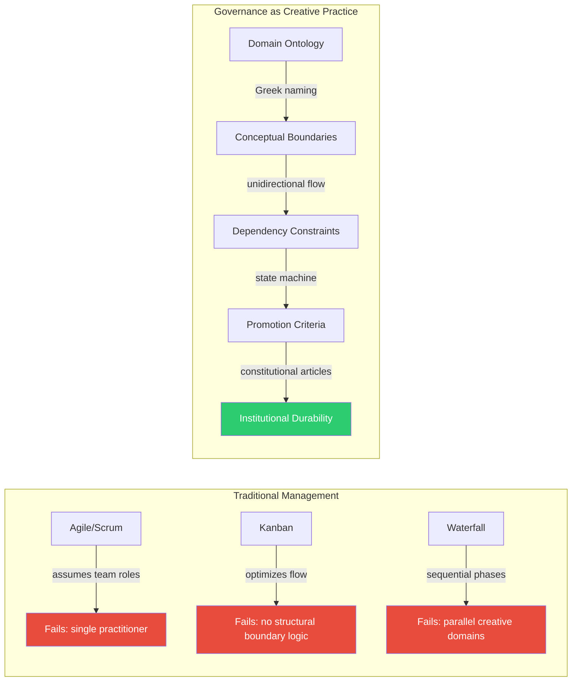
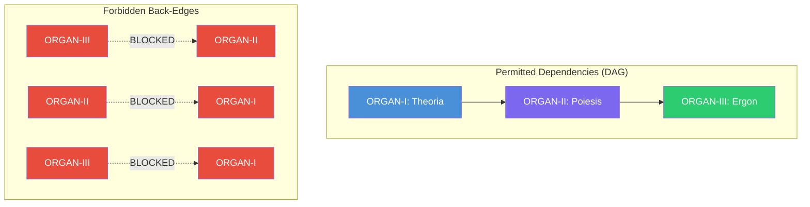

# Governance as Creative Practice: Why the Eight-Organ System Exists

## The Independence Trap

Artists prize independence above almost everything else. The freedom to choose your materials, set your schedule, follow an idea down an unmarked path without asking for permission — this is the core promise of creative life. I know because I chased that promise for years. I accumulated repositories the way some people accumulate half-finished canvases: dozens of them, each begun with genuine conviction, most abandoned somewhere between prototype and public release. The work existed. The coherence did not.

I had a recursive engine for generating narrative structures. I had a generative music system that could improvise in real time. I had a classroom RPG platform with paying users. I had an epistemic tuning framework that could evaluate its own knowledge boundaries. Each project was interesting on its own terms. Together, they were invisible. No one — not a grant reviewer, not a hiring manager, not a collaborator — could look at my GitHub profile and understand what I was doing or why any of it mattered. The projects existed in isolation because I had treated independence as the absence of structure rather than as something structure enables[^1].

This is the independence trap: the belief that creative freedom means creative formlessness. You avoid governance because governance sounds bureaucratic, institutional, uncreative. And then you wake up with seventy-nine repositories scattered across eight organizations and a personal account, no coherent narrative connecting them, no way to explain the system to anyone who has not lived inside your head for the past five years. Independence without structure is not freedom. It is fragmentation. Max Weber identified this paradox in his analysis of bureaucracy: rational-legal authority, far from destroying individual agency, creates the stable framework within which purposive action becomes possible[^2].

The eight-organ system — theory, art, commerce, orchestration, public process, community, marketing, and meta-coordination — is my answer to this problem. It is not a management framework. It is not project management imposed on creative work from outside. It is an artistic decision about how creative practice should organize itself when it reaches institutional scale but remains under the direction of a single practitioner. This essay explains why governance is the medium, not the overhead, and how treating it as such changes everything about what sustained creative practice can look like.

## Governance as Design Problem

Here is the situation I faced at the start of 2026. Seventy-nine repositories, mapped across seven thematic organs plus a meta-coordination umbrella. Sixty-four already live on GitHub, fifteen planned. Eight GitHub organizations. Theory repos that implement epistemological frameworks. Art repos that turn those frameworks into generative systems and interactive performances. Commerce repos that package art systems into products with actual users and actual revenue. An orchestration layer that is supposed to keep all of this coherent. A public process layer meant to document the whole thing transparently. Community infrastructure. Marketing and distribution.

How do you coordinate all of that without losing creative agency? This is a genuine design problem, not a management problem. Management problems have known solutions — you hire a project manager, adopt Scrum, run standups. But I am one person. There is no team to stand up with. There is no sprint planning meeting because there is no meeting. The scale is institutional but the headcount is not[^3].

Traditional management frameworks fail here for specific reasons. Agile assumes a team with discrete roles (product owner, scrum master, developer) and optimizes for shipping increments of a single product. I do not have a single product. I have a system of systems that spans epistemology, generative art, SaaS products, and community infrastructure. Scrum assumes that work can be decomposed into user stories that deliver customer value every two weeks. Some of my work is pure theory — the `recursive-engine--generative-entity` repo in ORGAN-I exists to formalize narrative as algorithm, and its value is measured in intellectual contribution, not sprint velocity. Kanban works better for flow-based work, but it does not address the structural question: how do you prevent a change in your art system from breaking your revenue-generating product?

The governance I needed had to satisfy unusual constraints. It had to coordinate across radically different domains — epistemology and commerce exist in different conceptual universes and require different evaluation criteria. It had to preserve creative autonomy — I am not trying to optimize for throughput; I am trying to enable sustained, high-quality creative work over years. It had to be legible to external evaluators — grant reviewers at the Knight Foundation, hiring managers at AI labs, residency selection committees at Eyebeam and Somerset House all need to understand what the system is and why it works. And it had to be forkable — the governance itself should be a reusable artifact, not a bespoke one-off that dies with this particular configuration. Donald Schon described this as the challenge of "reflective practice" — the practitioner must simultaneously act within a situation and reflect on the structure of that situation, designing the conditions for their own creative work even as they perform it[^4].

What does governance look like when you are the only person but the system has institutional scale? It looks like a creative practice. You design it the way you would design any other system: with intentional constraints, clear interfaces, legible structure, and enough flexibility to evolve without breaking.

## The Eight-Organ Model as Artistic Decision

The choice to organize creative work into eight organs with Greek ontological names was not decorative. It was a design decision with real structural consequences.

Each organ is named after an ancient Greek concept that defines its function: Theoria (contemplation, theory), Poiesis (making, artistic creation), Ergon (work, deed, product), Taxis (arrangement, order, governance), Logos (word, speech, reason), Koinonia (communion, fellowship), Kerygma (proclamation, announcement), and Meta (beyond, self-referential). These names appear in the GitHub organization identifiers themselves — `organvm-i-theoria`, `organvm-ii-poiesis`, `organvm-iii-ergon`, and so on — which means they are embedded in every URL, every cross-reference, every API call[^5].

This matters because the naming forces accountability. When I create a new repository in `organvm-i-theoria`, the name demands that the work genuinely contemplate. A utility script does not belong in Theoria. A product landing page does not belong in Theoria. Theory means theory: epistemological frameworks, recursive engines, ontological systems, conceptual research. The Greek root is not ornament; it is constraint. It forces every repo to justify its existence against millennia of philosophical tradition that defines what theoria actually is.

The same pressure applies across all eight organs. Poiesis means making — not theorizing about making, not planning to make, but the act of artistic creation itself. A repo in `organvm-ii-poiesis` must produce something: generative art, interactive systems, performance frameworks, experiential work. Ergon means the finished work, the deed, the product — repos in `organvm-iii-ergon` must serve real users and generate real revenue or deliver real utility. They cannot be speculative. Taxis means order and arrangement — the orchestration organ must genuinely coordinate, not just describe coordination. Logos means reasoned speech — the public process organ must articulate, explain, synthesize. Koinonia means fellowship — community infrastructure must genuinely facilitate connection. Kerygma means proclamation — the marketing organ must genuinely amplify.

Choosing these names was choosing to make the system accountable to its own etymology. Every time I consider where a new project belongs, the Greek roots act as gatekeepers. "Does this project genuinely contemplate, or does it merely tinker?" "Does this project genuinely make, or does it merely sketch?" The names carry twenty-five centuries of philosophical weight, and that weight is the point. A system labeled "Org-1" through "Org-8" would carry no such weight. The numbering would be arbitrary, the categorization negotiable, the boundaries soft. The Greek names make the boundaries philosophical, which makes them load-bearing. Pierre Bourdieu's concept of "field" is instructive here — each organ constitutes a distinct field of cultural production with its own internal logic, its own forms of capital, and its own criteria for evaluation[^6].

<figure>
<table>
<thead><tr><th>Organ</th><th>Greek Root</th><th>Domain</th><th>Evaluation Criterion</th><th>Lifecycle Role</th></tr></thead>
<tbody>
<tr><td>I. Theoria</td><td>Contemplation</td><td>Epistemology, recursion</td><td>Formal rigor, conceptual novelty</td><td>Think</td></tr>
<tr><td>II. Poiesis</td><td>Making</td><td>Generative art, performance</td><td>Aesthetic quality, emergence</td><td>Make</td></tr>
<tr><td>III. Ergon</td><td>Work, deed</td><td>SaaS, B2B, B2C</td><td>Revenue, user satisfaction</td><td>Ship</td></tr>
<tr><td>IV. Taxis</td><td>Arrangement</td><td>Orchestration, governance</td><td>System coherence</td><td>Coordinate</td></tr>
<tr><td>V. Logos</td><td>Speech, reason</td><td>Essays, documentation</td><td>Clarity, transparency</td><td>Document</td></tr>
<tr><td>VI. Koinonia</td><td>Fellowship</td><td>Salons, reading groups</td><td>Community engagement</td><td>Connect</td></tr>
<tr><td>VII. Kerygma</td><td>Proclamation</td><td>POSSE, distribution</td><td>Reach, amplification</td><td>Amplify</td></tr>
<tr><td>VIII. Meta</td><td>Beyond</td><td>Cross-org coordination</td><td>Systemic integrity</td><td>Reflect</td></tr>
</tbody>
</table>
<figcaption>Table 1. The eight organs with their etymological roots, domains, evaluation criteria, and lifecycle roles.</figcaption>
</figure>

There is also a compositional logic to the eight organs that mirrors how creative work actually flows. Theory (Theoria) generates conceptual frameworks. Art (Poiesis) instantiates those frameworks as creative systems. Commerce (Ergon) packages those systems for the world. Orchestration (Taxis) keeps the whole thing coherent. Public Process (Logos) documents it transparently. Community (Koinonia) enables others to participate. Marketing (Kerygma) amplifies what has been documented. Meta holds the umbrella. The eight organs together describe a complete lifecycle of creative production: think, make, ship, coordinate, document, connect, amplify, reflect. No stage of that lifecycle exists outside the system. And because the meta-organ sits above all seven, the system can observe and govern itself — it is, by design, recursive[^7].

The config file that drives all of this, `organvm.env`, makes the architecture explicit. One prefix variable — `ORGAN_PREFIX` — derives all eight organization names. Change the prefix from `organvm` to anything else and the entire system reconfigures. The template is the product. This instance is one configuration. That design decision — making the governance framework forkable and env-var-driven — is itself an artistic statement about what creative infrastructure should look like: portable, transparent, and replicable.

## Promotion Criteria as Creative Constraints

Every repository in the system follows a formal promotion pathway: LOCAL, then CANDIDATE, then PUBLIC_PROCESS, then GRADUATED, then ARCHIVED. These are not bureaucratic gates imposed by a manager who wants to slow things down. They are creative constraints, analogous to the way a sonnet's fourteen lines and volta force a poet to compress meaning, or the way a twelve-tone row forces a composer to find structure within an arbitrary sequence. Mihaly Csikszentmihalyi's research on creativity established that constraints are not the enemy of creative flow — they are its precondition. The "flow state" emerges precisely when challenges are matched to skills within a structured framework, not in conditions of unlimited freedom[^8].

The constraint forces quality because each state transition has specific criteria that must be satisfied. A repo at LOCAL status is under active development, not yet proposed for promotion. It can be messy, speculative, incomplete. That is fine. LOCAL is the workshop, the studio, the sketch. But to move to CANDIDATE, the repo must be proposed for cross-organ promotion and submitted for review. This means someone — in this case, me — has to make an explicit claim: "This work is ready to move from theory into art, or from art into commerce." That claim is testable.

The most important gate is the one I call the "Stranger Test," formalized in the README audit framework as Part 3 of the scoring rubric. The question is simple: would a grant reviewer seeing this repository for the first time be convinced? Not impressed, not entertained — convinced. Convinced that the work is real, that it solves a stated problem, that it connects to a larger system, that it has been maintained with care. The scoring rubric breaks this down into one hundred points across four dimensions: existence and accessibility (does the README exist, is it navigable, is it formatted cleanly), content completeness (is the problem statement clear, are there working examples, are dependencies documented), accuracy and currency (do the links work, do the code examples run, does the documentation match the code), and portfolio relevance (is it clear why this repo exists and how it connects to the larger system).

Flagship repos — the one or two repos per organ that represent the organ's best work — must score ninety or above. That threshold is not arbitrary. At ninety, a repo's documentation is production-ready: all links resolve, all examples work, all cross-references are accurate, the portfolio language is sharp enough for a grant application. Below ninety, something is missing — a broken link, a vague problem statement, a missing example. The constraint is that you cannot promote a repo to GRADUATED status until its documentation passes this threshold. The repo might contain brilliant code. The code is irrelevant if the documentation fails the Stranger Test[^9].

This system of constraints has a second-order effect that I did not anticipate when I designed it: it makes me write better documentation. Not because documentation is fun — it frequently is not — but because the promotion criteria make documentation a prerequisite for progress. If I want the recursive engine to move from Theory into Art, its README must be complete, its examples must work, its cross-references must be valid. The constraint converts a task I might otherwise defer into a task I must complete before anything else can happen. That is what good creative constraints do. They do not restrict freedom; they redirect effort toward the work that matters most. Richard Sennett calls this "resistance" — the craftsman's productive encounter with the limits of material, which generates skill, invention, and ultimately mastery[^10].

## Dependency Validation Prevents Cascading Failures

The unidirectional dependency rule — theory informs art, art produces commerce, never the reverse — is the structural backbone of the eight-organ system. Article II of the project constitution states it plainly: "Flow is I to II to III only. No back-edges: ORGAN-III cannot depend on ORGAN-II; ORGAN-II cannot depend on ORGAN-III. Dependency violations are structural failures, not style issues."

The word "structural" is deliberate. A style issue is a preference — tabs versus spaces, camelCase versus snake_case. You can argue about style issues and reasonable people can disagree. A structural failure is different. If ORGAN-III (Commerce) depends on ORGAN-II (Art), then a change to a generative music algorithm in ORGAN-II could break a revenue-generating coaching platform in ORGAN-III. The coaching platform has paying users. Those users do not care about generative music algorithms. They care that the platform works. A dependency from Commerce back to Art creates a coupling that makes the commercial product fragile in ways that have nothing to do with its actual function[^11].

The unidirectional constraint eliminates this class of failure entirely. Theory repos can change freely because only Art repos depend on them, and Art repos are designed to absorb theoretical changes — that is their purpose. Art repos can change freely because only Commerce repos depend on them, and Commerce repos are designed to package stable art systems — they snapshot functionality rather than track bleeding-edge artistic experiments. Commerce repos cannot reach back into Art for a dependency because the system forbids it. If a Commerce product needs something from an Art system, the solution is to promote a stable version of the art system into a Commerce-compatible package, not to create a runtime dependency across organ boundaries.

ORGAN-IV (Taxis, Orchestration) sits outside this linear flow. It observes all organs, reads from the central registry, and validates that no circular dependencies have been introduced. ORGAN-V (Logos, Public Process) also sits outside — it documents all organs but no organ depends on ORGAN-V for functionality. ORGAN-VI (Koinonia, Community) facilitates work across all organs without creating hard dependencies. ORGAN-VII (Kerygma, Marketing) amplifies ORGAN-V content but does not feed back into it. The result is a directed acyclic graph with a clear primary flow and auxiliary organs that observe, document, connect, and amplify without creating cycles. Donella Meadows's framework for resilient systems confirms this pattern: systems that maintain clear, unidirectional information flows are more robust than those with tangled feedback loops where every component can influence every other[^12].

This structure costs something. It means I cannot take shortcuts. If a Commerce product could benefit from a function in an Art repo, I cannot simply import it — I have to extract the function into a stable interface and promote it properly. That is slower. But the slowness is the point. The constraint forces me to think about boundaries, interfaces, and stability before I act. That thinking prevents the cascading failures that would otherwise accumulate in a system of seventy-nine repositories.

## The Constitution

The project constitution is a one-page document that governs all specifications and quality gates. Six articles and four amendments. It is short because constitutional documents should be short — they define principles, not procedures. Procedures change; principles persist. Elinor Ostrom's research on long-enduring institutional arrangements found that the most successful commons governance systems share a common feature: their rules are concise, locally adapted, and modifiable through defined processes — exactly the qualities a creative-institutional constitution must have[^13].

Article I establishes the registry as the single source of truth. All repo state lives in `registry-v2.json`. The registry is never wrong. If reality and registry disagree, you update the registry or fix reality. No document, workflow, or agent may claim authoritative repo state outside the registry. This sounds severe, and it is. The alternative — distributed state across multiple documents, each potentially stale — is the default failure mode of every documentation system I have ever seen. A single source of truth eliminates an entire category of inconsistency bugs.

Article II codifies the unidirectional dependency rule described above. Article III requires that all eight organs be visible at launch — each organ must have at least one representative, whether a fully documented flagship or a minimal stub. The eight-organ system must be visible in its entirety because the system is the argument. Showing six of eight organs is like presenting a symphony with two movements missing. The evaluator cannot judge the architecture if parts of it are absent.

Article IV states that documentation precedes deployment. No Phase N+1 until Phase N is complete. Documentation is the deliverable, not an afterthought. This article directly inverts the typical engineering workflow where code ships first and documentation follows (if it follows at all). In the eight-organ system, the documentation is the primary artifact. The code supports the documentation, not the other way around[^14].

Article V requires that every README be a portfolio piece, written for grant reviewers and hiring managers, not just developers. This is the "Stranger Test" elevated to constitutional status. Article VI formalizes the promotion state machine (LOCAL through ARCHIVED) as the only valid pathway for cross-organ promotion.

The four amendments address practical realities discovered during implementation. Amendment A establishes the Bronze Tier launch path: five perfect flagship repos are worth more than forty-four mediocre ones. This amendment permits a tiered launch where organs achieve different levels of completeness, provided each organ has at least one fully documented flagship. Amendment B budgets ten percent of every phase's token expenditure for coordination overhead — reconciling parallel AI-generated content streams is real work that must not be hidden inside task estimates. Amendment C requires specific schema fields in the registry before Phase 2. Amendment D acknowledges AI non-determinism: the same prompt produces different outputs across different models and across different runs of the same model. All AI-generated deliverables require human review. Budget estimates use scenario banding, not point estimates.

<figure>

6

Constitutional Articles

4

Amendments

5

Promotion States

100

Point Scoring Rubric

90+

Flagship Threshold

0

Back-Edges Permitted

<figcaption>Figure 2. Constitutional governance metrics for the eight-organ system.</figcaption>
</figure>

The constitution is remarkable not for what it contains but for the fact that it exists at all. Solo creative practitioners almost never write constitutions for their work. The constitution exists because the system reached a scale where ad-hoc decision-making became dangerous. Without it, every governance question — "Should this repo be promoted? Does this documentation meet the standard? Is this dependency acceptable?" — requires re-deriving the answer from first principles. The constitution converts repeated deliberation into lookup. You check the articles, you check the amendments, you check the quality gates. The answer is determined by the document, not by my mood on a given afternoon.

## Practitioners Who Treat Infrastructure as Art

I am not the first person to treat governance and infrastructure as primary creative output. The lineage is small but clear, and understanding it matters because it establishes that this kind of work is art, not merely administration that an artist happens to perform[^15].

Julian Oliver is an artist and critical engineer whose work directly challenges the boundary between infrastructure and artistic practice. The Critical Engineering Manifesto, which Oliver co-authored, opens with the statement: "The Critical Engineer considers Engineering to be the most transformative language of our time." Oliver's work — network interventions, embedded systems, surveillance countermeasures — treats protocols and systems as expressive media. The infrastructure is not supplementary to the art; the infrastructure is the art. When Oliver builds a system that intercepts wireless traffic and renders it as a visual installation, the governance of that system — how it handles data, what it exposes, what it conceals — is an artistic decision with ethical and aesthetic consequences. The eight-organ system follows this tradition. The registry, the promotion criteria, the dependency graph, the constitution — these are not documentation about art. They are artifacts of a creative practice that treats coordination as an expressive medium.

Nicky Case works in a different register but arrives at a similar conclusion. Case's Explorable Explanations — interactive systems that teach by letting the reader manipulate variables and observe emergent behavior — demonstrate that the system itself is the content. There is no separation between the explanation and the thing being explained. When Case builds an interactive simulation of game theory or network effects, the interface, the interaction model, and the underlying system architecture are all part of the artistic statement. The documentation is not separate from the work; it is the work. ORGAN-V (Public Process) operates on the same principle: the essays about the eight-organ system are not meta-commentary on something that exists elsewhere. They are part of the system itself. The act of documenting governance publicly, transparently, in portfolio-quality prose, is itself a creative act within the system it describes.

Hundred Rabbits — the creative studio of Devine Lu Linvega and Rekka Bellum, who live and work on a sailboat — represent perhaps the most radical version of this ethos. Their tools (Uxn, Varvara, Left, Nasu) are built for extreme resource constraint. Their documentation is meticulous. Their development philosophy — sustainable computing, offline-first design, radical simplicity — is itself an artistic position. The governance of their creative practice (what they build, how they build it, what constraints they accept) is inseparable from the work. When Linvega builds a virtual machine that runs on 64KB of memory, the constraint is the art. When Hundred Rabbits documents their tool ecosystem with the same care they apply to their music and visual work, the documentation is the art. Their entire practice demonstrates that protocols and governance structures can be primary artistic output, not supplementary administrative overhead.

These three practitioners — Oliver, Case, Linvega and Bellum — establish a clear precedent: infrastructure is a legitimate creative medium. The eight-organ system positions itself within this tradition. The registry is not a spreadsheet. It is a narrative about how creative work organizes itself. The constitution is not a legal document. It is a set of artistic constraints that shape every decision in the system. The promotion criteria are not bureaucratic gates. They are the equivalent of formal constraints in poetry — structures that force quality by limiting what is permissible.

## Building Infrastructure Others Can Learn From

The eight-organ system is env-var-driven by design. The configuration file `organvm.env` ships as a template with sensible defaults. The prefix variable `ORGAN_PREFIX` derives all eight organization names. The Greek ontological suffixes are defaults that can be overridden. The machine-readable config `organvm.config.json` maps organ numbers to suffixes, environment variables, domains, etymologies, portfolio angles, and feature flags. The instance-specific config `organvm.env.local` is gitignored — it contains the specific prefix (`organvm`) and personal account (`4444J99`) that make this particular instance mine.

Anyone can fork this infrastructure and configure their own creative system. Change the prefix from `organvm` to `studio-k` and you get `studio-k-i-theoria`, `studio-k-ii-poiesis`, `studio-k-iii-ergon`. Keep the Greek suffixes or override them — the system does not care. The governance rules, the constitution, the promotion criteria, the dependency model, the scoring rubric, the audit framework — all of it transfers. The template is the product. This instance is one configuration. Christopher Alexander's pattern language approach — where design solutions are expressed as reusable, composable patterns rather than fixed blueprints — directly informs this architectural decision. The eight-organ system is not a building; it is a pattern language for creative infrastructure[^16].

This matters for the same reason that open-source software matters: infrastructure that others can learn from multiplies the impact of the work. If the eight-organ system were a bespoke, hardcoded, non-transferable configuration, it would be impressive but inert. Because it is env-var-driven and documented from first principles, it becomes a contribution to the broader conversation about how artist-engineers can organize sustained creative practice. A residency evaluator at Eyebeam or Somerset House can look at this system and see not just a portfolio but a methodology. A collaborator can fork it and adapt it. A student can study the governance decisions and understand why each constraint exists.

The documentation itself — the constitution, the orchestration system document, the public process map, the implementation package, the README audit framework — is written at a level of detail that makes the reasoning transparent. Every decision is explained. Every constraint is justified. Every trade-off is named. This is not documentation that says "do this." It is documentation that says "here is what we chose, here is why, here is what we considered and rejected, and here is how you would make a different choice." That level of transparency is rare in creative practice, and it is what makes the system genuinely useful to others. Jurgen Habermas's ideal of communicative rationality — that legitimate governance derives from transparent argumentation accessible to all participants — provides the philosophical foundation for this commitment to documentary transparency[^17].

## Closing

Systems thinking is not opposed to artistic freedom. It enables it. The eight-organ system exists because I reached a scale of creative output where formlessness became a liability. Dozens of repositories, multiple domains, theory and art and commerce all developing in parallel — without explicit governance, the work was invisible to everyone except me. The system I built is not a management framework imposed on creative work. It is a creative framework that treats governance as its primary medium.

Clear governance makes creative collaboration possible, even when the "collaboration" is between different aspects of a single practitioner's work. The promotion criteria, the dependency rules, the constitution, the scoring rubric — these structures ensure that when I move from theory to art to commerce, the transitions are intentional, the quality is controlled, and the boundaries are maintained. The constraints do not limit what I can make. They ensure that what I make is coherent, documented, and visible.

Documentation is part of the artwork. Not documentation about the artwork — documentation as the artwork. The registry is a narrative device. The constitution is a set of artistic constraints. The public process essays are performances of transparency. The env-var-driven architecture is a statement about portability and replicability. Every layer of governance in the eight-organ system is simultaneously functional (it keeps the system coherent) and expressive (it articulates a position about what creative infrastructure should look like).

The independence trap — the belief that creative freedom requires creative formlessness — is a trap because it leads to fragmentation, invisibility, and abandoned work. The way out is not to abandon independence but to build structure that serves it. Governance as creative practice means designing the structure yourself, making every constraint intentional, and treating the system's architecture as an artifact worthy of the same care you give to the work it coordinates.

---

**Next:** [Essay 3: "The Meta-System as Portfolio Asset: Why Application Reviewers Care About Orchestration"](/essays/meta-system/03-meta-system-as-portfolio-asset.md)
**Discuss:** [GitHub Discussions](https://github.com/organvm-v-logos/public-process/discussions)
**Cite:** @4444J99 (2026). "Governance as Creative Practice: Why the Eight-Organ System Exists." *Public Process*, ORGAN-V: Logos.

[^1]: Scott, J. C., *Seeing Like a State: How Certain Schemes to Improve the Human Condition Have Failed*, Yale University Press, 1998. Scott's analysis of how high-modernist schemes fail when they ignore the practical knowledge of those who inhabit a system illuminates the independence trap from the inverse direction: formlessness is as destructive as over-schematization.

[^2]: Weber, M., *Economy and Society*, University of California Press, 1922 (English trans. 1978). Weber's theory of rational-legal authority demonstrates that bureaucratic structure, when designed intentionally, enables rather than constrains purposive action.

[^3]: Ostrom, E., *Governing the Commons: The Evolution of Institutions for Collective Action*, Cambridge University Press, 1990. Ostrom's work on polycentric governance — where multiple overlapping authorities manage shared resources — provides the theoretical foundation for a system where one practitioner governs multiple autonomous domains.

[^4]: Schon, D. A., *The Reflective Practitioner: How Professionals Think in Action*, Basic Books, 1983. Schon's concept of "reflection-in-action" — the practitioner's ability to think about what they are doing while doing it — describes the dual role of the artist-engineer who must simultaneously create and govern their creative infrastructure.

[^5]: Alexander, C., Ishikawa, S., and Silverstein, M., *A Pattern Language: Towns, Buildings, Construction*, Oxford University Press, 1977. Alexander's principle that the names of patterns carry generative force — that naming a pattern correctly helps produce the quality it describes — directly informs the Greek naming decision.

[^6]: Bourdieu, P., *The Field of Cultural Production: Essays on Art and Literature*, Columbia University Press, 1993. Bourdieu's field theory provides the sociological framework for understanding how each organ constitutes a semi-autonomous domain with its own internal logic and forms of capital.

[^7]: Meadows, D. H., *Thinking in Systems: A Primer*, Chelsea Green Publishing, 2008. The eight-organ lifecycle (think, make, ship, coordinate, document, connect, amplify, reflect) maps onto Meadows's concept of system archetypes — recurring patterns of behavior that emerge from structural relationships.

[^8]: Csikszentmihalyi, M., *Creativity: Flow and the Psychology of Discovery and Invention*, Harper Perennial, 1996. Chapter 5 on the relationship between constraints and creative flow establishes that structured frameworks, not unlimited freedom, produce the conditions for sustained creative work.

[^9]: Habermas, J., *The Theory of Communicative Action*, Beacon Press, 1981 (English trans. 1984). The Stranger Test operationalizes Habermas's validity claims — that any assertion must be comprehensible, true, truthful, and appropriate — in the specific context of portfolio documentation.

[^10]: Sennett, R., *The Craftsman*, Yale University Press, 2008. Sennett's analysis of how craftsmen develop mastery through productive encounter with material resistance directly parallels the role of promotion constraints in the eight-organ system.

[^11]: Meadows, D. H., *Thinking in Systems: A Primer*, Chelsea Green Publishing, 2008. The distinction between "structural failure" and "style issue" maps onto Meadows's distinction between system structure (which determines behavior) and system events (which are symptoms of structure).

[^12]: Meadows, D. H., *Thinking in Systems: A Primer*, Chelsea Green Publishing, 2008. Meadows's leverage points framework — particularly the insight that system structure is a more powerful intervention point than parameter adjustment — validates the unidirectional constraint as a structural rather than procedural governance mechanism.

[^13]: Ostrom, E., *Governing the Commons: The Evolution of Institutions for Collective Action*, Cambridge University Press, 1990. Design principle 3 (collective-choice arrangements that allow most resource appropriators to participate in the decision-making process) applies even in a solo-practitioner context: the constitution makes governance rules explicit and modifiable rather than tacit and fixed.

[^14]: Sennett, R., *The Craftsman*, Yale University Press, 2008. Sennett's argument that the craftsman's deepest skill is knowing when to stop — when the work is ready to leave the workshop — directly informs Article IV's requirement that documentation precedes deployment.

[^15]: Bourdieu, P., *The Field of Cultural Production: Essays on Art and Literature*, Columbia University Press, 1993. Bourdieu's concept of "position-taking" within a cultural field — where artists define their practice in relation to existing positions — explains why situating the eight-organ system within the Oliver/Case/Hundred Rabbits lineage is a constitutive, not merely descriptive, act.

[^16]: Alexander, C., Ishikawa, S., and Silverstein, M., *A Pattern Language: Towns, Buildings, Construction*, Oxford University Press, 1977. The env-var-driven architecture implements Alexander's core insight: that good design is not a fixed artifact but a generative grammar that produces quality in each new instantiation.

[^17]: Habermas, J., *The Theory of Communicative Action*, Beacon Press, 1981 (English trans. 1984). Habermas's discourse ethics — that norms are legitimate only if they could be accepted by all affected parties in rational discourse — provides the philosophical warrant for making governance documentation publicly transparent rather than internally opaque.
