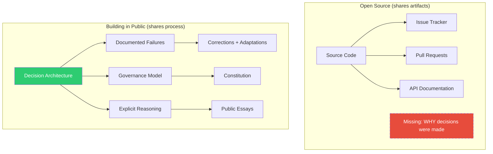
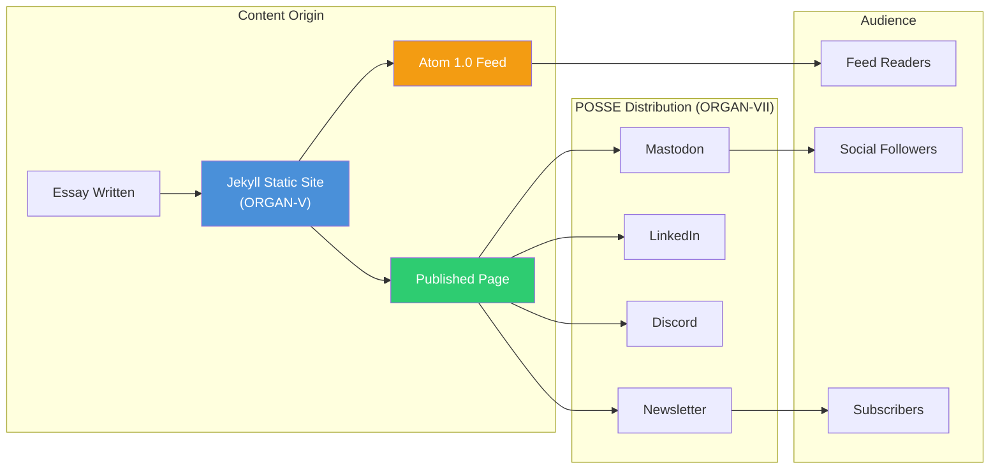

# Building in Public: Radical Transparency as Creative Methodology

There is a moment in every creative project where you decide what to show and what to hide. Most of us, trained by years of portfolio culture and product launches, choose to hide the mess. We present the finished artifact, the polished README, the deployed application. The scaffolding comes down before the ribbon is cut. The drafts are deleted. The failed experiments are quietly archived. I have spent the last several months doing the opposite — building an entire creative-institutional system in public, documenting not just the outputs but the decisions, the failures, the governance model, and the reasoning behind every structural choice. This essay is about why that matters, and why building in public is not a marketing strategy but a methodology.

## Building in Public vs. Open Source

Open source and building in public are frequently conflated, but they are fundamentally different practices with different epistemologies. Open source shares code. It gives you the artifact — the function, the library, the framework. You can read the source, file issues, submit pull requests. But open source, in its conventional form, rarely shares the *why*. Why was this architecture chosen over that one? What failed before this approach worked? What constraints shaped the design? The commit history tells you *what* changed; it almost never tells you *why* it changed. Eric Raymond's influential essay "The Cathedral and the Bazaar" celebrated the open-source model's capacity for distributed development, but even Raymond acknowledged that the bazaar model works best when there is a clear vision — a "plausible promise" — that coordinates contribution. The promise is the why; the code is merely the what[^1].

Building in public shares decisions, failures, process, and reasoning. It treats the creative process itself as a deliverable — not just the output of that process. When I designed the organvm system — an eight-organ creative infrastructure spanning approximately 44 GitHub repositories across 8 GitHub organizations — I made a deliberate choice to make the planning corpus itself a public artifact. The governance model is documented in a constitution with six articles and four post-cross-validation amendments. The failures are recorded: the prefix correction from "organvum" to "organvm" that required approximately 170 search-and-replace operations across 34 files. The metrics are visible: 208,000 words deployed across 58 repository READMEs and 8 organizational profiles. The reasoning is explicit: why eight organs, why Greek names (theoria for theory, poiesis for art, ergon for commerce, taxis for orchestration, logos for public discourse, koinonia for community, kerygma for proclamation), why unidirectional dependency flow where Organ I feeds Organ II feeds Organ III but never the reverse[^2].

This distinction matters because open source without process documentation creates a specific kind of opacity. You can see *what* someone built, but you cannot learn *how* they think. And in a world where AI can generate code at volume, the thinking — the decision architecture, the governance model, the priority framework — is the irreducible human contribution. Building in public is, in this sense, an assertion that process has independent value. The scaffolding is part of the building. Michael Polanyi's concept of "tacit knowledge" — the things we know but cannot easily articulate — is relevant here: building in public is a deliberate practice of converting tacit knowledge into explicit, documented, transferable form[^3].

The organvm system makes this concrete. The planning corpus contains over 34 documents organized into four layers: genesis transcripts, phase planning documents, strategic frameworks, and implementation specifications. Each layer is public. Each layer is annotated. The reading order is specified. The cross-document dependency map is drawn. Someone encountering this system for the first time can trace the full reasoning chain from initial conversation to deployed infrastructure — not because I owe them that transparency, but because the transparency itself strengthens the system. Decisions that must survive public scrutiny tend to be better decisions.

## Radical Transparency: Sharing Decisions and Failures

The planning corpus for the organvm system is, by any measure, unusually detailed. It contains genesis transcripts — documents labeled 00-a and 00-b, each representing over sixty minutes of structured conversation that produced the foundational architecture. It contains an audit framework (01-readme-audit-framework.md) with a 0-to-100 scoring rubric that evaluates every repository README across dimensions like technical clarity, portfolio language, cross-reference integrity, and audience awareness. It contains a risk mitigation map (05-risk-mitigation-map.md) that catalogs failure modes from "AI-generated boilerplate phrasing" to "premature exposure of incomplete work." It contains a corpus coherence review (09-corpus-coherence-review.md) that cross-validates all planning documents against each other for internal consistency[^4].

This level of documentation is not accidental. It is the methodology itself. And the most valuable entries in this corpus are not the successes — they are the failures and corrections.

Consider the prefix correction. Early in the project, the organizational prefix was set to "organvum" — an extra letter that propagated through configuration files, registry entries, document references, and template variables. When the error was caught, correcting it required approximately 170 replacements across 34 files. This is, in conventional project management terms, embarrassing. A typo in a foundational name, propagated through an entire corpus. The instinct is to fix it quietly and never mention it again. Instead, the correction is documented. The replacement count is recorded. The affected files are listed. Why? Because the failure demonstrates something important about the system: it has enough internal consistency that a single-point change propagates predictably. The fact that a prefix error touched 34 files means the prefix is used consistently across 34 files. The correction proves the architecture[^5].

Similarly, the expansion from seven organs to eight — adding meta-organvm as the umbrella organization above the seven domain-specific organs — is documented as a structural evolution, not hidden as a design oversight. The original model had seven organs. The realization that an eighth meta-organ was needed to coordinate the other seven emerged from the planning process itself. Rather than retroactively pretending the system was always eight organs, the corpus preserves the evolution. The seven-to-eight expansion required adding meta-organvm rows to all organizational tables, updating the profile README generator to produce an eighth row, and reconciling approximately 170 replacements across the documentation.

The Bronze, Silver, and Gold sprint model emerged from another honest realization: that five perfect repositories beat forty-four mediocre ones. The original plan aimed for comprehensive documentation across all repositories simultaneously. The Bronze sprint refocused on seven flagship READMEs — one per organ — at the highest quality standard. Only after those seven flagships were deployed and validated (34 out of 34 validation items passing) did the Silver sprint expand to cover the remaining 58 repositories. This pivot is documented not as a failure of the original plan but as an adaptation — a decision made transparently, with reasoning attached. Donald Schon's framework of "reflective practice" describes exactly this pattern: the competent practitioner does not simply execute a plan but continuously reflects on the plan's adequacy, adjusting course when the situation demands it[^6].

<figure>
<table>
<thead><tr><th>Transparency Level</th><th>What Is Shared</th><th>What Is Withheld</th><th>Rationale</th></tr></thead>
<tbody>
<tr><td>Full Public</td><td>58 repo READMEs, ORGAN-V essays, constitution, registry structure</td><td>Nothing</td><td>Portfolio-grade work benefits from maximum visibility</td></tr>
<tr><td>Process Public</td><td>Planning corpus, failure documentation, sprint pivots, governance evolution</td><td>Draft iterations, abandoned approaches</td><td>Process transparency builds trust; draft noise does not</td></tr>
<tr><td>Structure Public</td><td>Private repo existence, registry entries for private repos</td><td>Private repo contents</td><td>System legibility requires acknowledging all components</td></tr>
<tr><td>Private</td><td>Nothing</td><td>Financial systems, payment infrastructure, proprietary business logic</td><td>Commercial sensitivity, user data protection</td></tr>
</tbody>
</table>
<figcaption>Table 1. Four transparency levels in the organvm system with rationale for each boundary.</figcaption>
</figure>

## Documentation as Audience Connection

Article V of the organvm constitution states: "Every README is a portfolio piece, written for grant reviewers and hiring managers, not just developers." This is not a marketing directive. It is an epistemological claim about who documentation serves and why it exists.

The conventional model of technical documentation assumes a single audience: the developer who will use or contribute to the code. This produces documentation that is efficient but narrow — API references, installation instructions, configuration options. It answers the question "how do I use this?" but rarely answers "why does this exist?" or "what capability does this demonstrate?" or "what problem domain does this address and why does that domain matter?"[^7]

The organvm system applies what I call the Stranger Test: would a grant reviewer encountering this repository for the first time, with no prior context about the project or the author, be convinced that this represents serious, rigorous, portfolio-grade work? This test produces documentation that serves double duty. It helps contributors understand the codebase AND demonstrates capability to external evaluators. The 58 repository READMEs, each at 2,000 words or more, are simultaneously technical documentation and portfolio pieces.

The results speak in specifics. The recursive-engine README runs to 3,738 words and covers not just the technical implementation but the epistemological framework — why recursive self-modification matters as a computational paradigm, what the theoretical foundations are, how this connects to the broader Organ I (Theoria) mission. The public-record-data-scrapper README reaches 4,455 words and addresses not just the scraping methodology but the ethical framework for public records access, the legal landscape, and the product positioning within Organ III (Ergon). The agentic-titan README extends to 4,678 words and situates the project within the broader agent-orchestration landscape while explaining the specific architectural decisions that distinguish it[^8].

These are not bloated documents. They are documents that respect their audience enough to provide context, reasoning, and positioning alongside technical specification. When a grant reviewer reads the agentic-titan README, they do not just learn what the software does — they learn how the author thinks about agent orchestration, what design trade-offs were considered, and why this approach was chosen. That is the connection that documentation-as-portfolio creates: not just information transfer but intellectual engagement.

The word count targets — 3,000 words for flagships, 2,000 words for standard repositories — are quality specifications within an AI-conductor workflow model. AI generates the volume; the human ensures accuracy, voice, and strategic positioning. This is itself a transparent methodology: acknowledging that AI is part of the production pipeline rather than pretending every word was hand-typed. Nadia Eghbal's research on open-source sustainability highlights a parallel concern: the most valuable contribution to a software ecosystem is often not code but the curation, documentation, and governance work that makes code usable — what she calls "the commons that code depends on"[^9].

## RSS, Newsletter, and POSSE

Organ V (Logos — public discourse) publishes through a static site built on Jekyll with an Atom 1.0 RSS feed. This is a deliberate architectural choice. Static sites are durable. They do not require databases, server maintenance, or platform subscriptions. An Atom feed is a twenty-year-old standard that every feed reader on earth can parse. These are boring technology choices, and that boringness is the point.

Organ VII (Kerygma — proclamation, announcement) handles POSSE distribution: Publish on Own Site, Syndicate Elsewhere. Content originates on the organvm-owned domain, then copies are syndicated to Mastodon, LinkedIn, and Discord. The canonical version always lives on infrastructure I control. The syndicated copies are references, not originals.

This architecture reflects an IndieWeb principle that has only become more urgent as platform instability has accelerated: own your content, syndicate copies. When a social media platform changes its algorithm, restricts its API, or ceases to exist entirely, the canonical content remains untouched on the owned domain. The RSS feed continues to work. The newsletter continues to deliver. The intimate channel — the feed reader, the inbox — is more durable and more meaningful than the social media timeline. Cory Doctorow has argued persuasively that platform dependency is a form of "chokepoint capitalism" — the concentration of distribution power that extracts value from creators. POSSE is the architectural antidote[^10].

POSSE is not anti-social-media. It is pro-resilience. It acknowledges that platforms are distribution channels, not homes. Building in public means publishing on ground you own and letting the networks carry echoes.

## Community Contribution Enabled by Clarity

When governance is transparent, contribution becomes possible. This is not a platitude — it is a structural observation about how open systems work. Christopher Kelty's ethnographic study of free software communities demonstrated that what holds such communities together is not shared code but shared "recursive publics" — communities that are constituted by their own discourse about the conditions of their existence. The organvm public-process essays function as exactly this kind of recursive discourse[^11].

Organ VI (Koinonia — fellowship, community) can exist as a functional organ because Organ IV (Taxis — order, orchestration) makes the rules visible. The governance model is documented. The dependency graph is published. The promotion state machine — LOCAL to CANDIDATE to PUBLIC_PROCESS to GRADUATED to ARCHIVED — is explicit. A potential contributor does not need to guess how the system works, what the quality standards are, or how decisions are made. They can read the constitution. They can examine the audit framework. They can trace the scoring rubric.

This transparency enables specific community activities: reading groups organized around the planning corpus, salons where the architectural decisions are discussed and debated, collaborative documentation where contributors improve READMEs using the same scoring rubric the author uses. The governance is not a gate; it is an invitation. It says: here are the rules, here are the standards, here is how to participate.

The env-var-driven architecture makes this structural transparency actionable. The configuration system uses a template file (organvm.env) that provides defaults and an instance file (organvm.env.local, gitignored) that contains the specific configuration. A machine-readable mapping file (organvm.config.json) connects organ numbers to Greek suffixes, environment variables, and domain names. This means the eight-organ model is not locked to the "organvm" prefix or to my specific organizational structure. Anyone can fork the template, set their own prefix, configure their own organ names, and deploy their own creative infrastructure using the same governance model.

The template is the product. This instance — organvm with its eight organs and 79 repositories — is one configuration of that template. The system is designed to be reproducible, not proprietary. Building in public means building in a way that others can replicate, adapt, and improve. The documentation is not just a record of what was built; it is a blueprint for building something similar.

This is where building in public diverges most sharply from marketing. Marketing says: look at what I made, admire it, buy it. Building in public says: here is how I made it, here is why I made these choices, here is how you can make something like it. The value proposition is not the artifact but the methodology[^12].

## Risk Mitigation

Building in public carries real risks, and pretending otherwise would undermine the very transparency this essay advocates. The risks are concrete: premature exposure of incomplete work, copycats who take the architecture without the reasoning, criticism from people who encounter the project before it is ready for scrutiny, and the cognitive overhead of maintaining public documentation alongside the actual building.

The organvm system mitigates these risks structurally, not aspirationally.

Article IV of the constitution states: "Documentation precedes deployment — no Phase 2 until Phase 1 is complete." This means nothing goes public undocumented. A repository that is not ready for public scrutiny remains in the LOCAL state. The documentation-first mandate ensures that by the time a repository is visible, it has already passed through the scoring rubric and met the quality threshold. Premature exposure is prevented by process, not by willpower[^13].

Article VI establishes the promotion state machine: LOCAL, CANDIDATE, PUBLIC_PROCESS, GRADUATED, ARCHIVED. Each state has entry criteria. A repository cannot be promoted from LOCAL to CANDIDATE without meeting documentation standards. It cannot reach PUBLIC_PROCESS without passing cross-organ dependency checks. It cannot graduate without integration validation. This state machine gates visibility — it ensures that the public sees work that has been through a defined quality process, not work that happens to be on a public GitHub repository.

<figure>

34

Planning Documents

4

Transparency Levels

170

Prefix Corrections

3

Private Repos (ORGAN-III)

34/34

Bronze Validation Items

100

Point Scoring Rubric

<figcaption>Figure 2. Transparency and risk mitigation metrics for the building-in-public methodology.</figcaption>
</figure>

For sensitive commercial work, the system uses private repositories. Organ III (Ergon — commerce) contains three private repositories for financial systems, payment infrastructure, and proprietary business logic. Building in public does not mean building in the open indiscriminately. It means being transparent about what is public, what is private, and why. The registry-v2.json file, which is itself public, marks these repositories as private. The existence of private repositories is public knowledge; their contents are not.

The registry also honestly accounts for incompleteness. Of the 79 total repositories tracked, 15 are in the "planned" state — not yet created. This is public information. The system does not pretend to be further along than it is. The Bronze sprint shipped 7 flagship READMEs. The Silver sprint expanded to 58. Fifteen repositories remain planned. That progression is documented, dated, and verifiable.

The risk of copycats is mitigated by the depth of the planning corpus. The eight-organ model is easy to copy superficially — create eight GitHub organizations with Greek names. But the value is not in the names; it is in the governance model, the dependency constraints, the documentation standards, the promotion state machine, the cross-organ validation process, and the constitutional principles. Copying the surface without copying the depth produces a hollow imitation. And if someone copies the depth — reads all 34 planning documents, implements the governance model, adapts the scoring rubric — that is not theft. That is the system working as intended. The template is the product.

## Values and Closing

The values that underpin building in public are, ultimately, the values that underpin good scholarship: reproducibility, knowledge transfer, and accessible practice[^14].

Reproducibility means that someone else, given the same inputs and constraints, could produce a similar output. The organvm planning corpus is designed to be reproducible. The configuration is templated. The governance model is documented. The scoring rubric is published. The sprint model is explicit. A different person with a different creative practice could fork the template, adapt the organ names to their own domains, configure the governance to their own standards, and deploy their own creative infrastructure. They would not produce the same system — their organs would be different, their repositories would address different problems, their constitution would reflect different values. But they could produce a system with the same structural integrity, because the methodology is transferable.

Knowledge transfer means that the work produces learning, not just artifacts. The 58 repository READMEs at 2,000-plus words each are teaching material as much as they are documentation. Each README explains not just what the software does but why it exists, what problem domain it addresses, what architectural decisions shaped it, and how it connects to the broader organ system. A reader who works through the Organ I repositories learns something about epistemology and recursive systems. A reader who works through the Organ II repositories learns something about generative art and creative computation. A reader who works through the Organ III repositories learns something about product architecture and revenue model design. The documentation transfers knowledge because it was written with the Stranger Test in mind — for the reader who arrives with no context and needs to understand not just the code but the thinking behind it.

Accessible practice means that the methodology lowers barriers rather than raising them. Portfolio-grade documentation is often associated with elite institutions and well-funded organizations. The organvm system demonstrates that a solo practitioner, working with AI tools in an AI-conductor model, can produce institutional-quality documentation across dozens of repositories. The TE (Tokens-Expended) budget model — measuring effort in LLM API tokens rather than human-hours — makes the economics explicit. A 3,000-word README costs approximately 72,000 tokens to generate, revise, and validate. That is a few dollars of API cost, not weeks of technical writing. This accessibility is part of the public process: showing not just the output but the production economics[^15].

Building in public is not marketing. Marketing presents a curated image designed to generate demand. Building in public presents an honest process designed to generate understanding. The difference is not superficial — it reflects a fundamentally different relationship between creator and audience. Marketing asks: how can I get your attention? Building in public asks: how can I earn your trust?

Failure documented is more valuable than success hidden. The prefix correction, the seven-to-eight organ expansion, the pivot from comprehensive to flagship-first sprints — these are not embarrassments. They are evidence of a system that adapts, corrects, and improves. A project that has never failed publicly has either never been tested or has hidden its failures. Neither inspires confidence.

Your process matters as much as your output. In a world saturated with polished products and curated portfolios, the honest display of methodology — the governance model, the decision architecture, the quality framework, the failure log — is a differentiator not because it is rare (though it is) but because it is useful. It teaches. It enables reproduction. It invites contribution. It builds the kind of trust that no amount of marketing can manufacture.

The organvm system is one implementation of this principle. The eight organs, the 79 repositories, the 208,000 words of documentation, the constitutional governance, the sprint model, the scoring rubric — these are outputs of a methodology. The methodology is the deeper contribution. And the methodology is public because it was built in public, documented in public, corrected in public, and shared in public. That is not a strategy. That is how I work.

[^1]: Raymond, E. S., *The Cathedral and the Bazaar: Musings on Linux and Open Source by an Accidental Revolutionary*, O'Reilly Media, 1999. Raymond's distinction between "cathedral" (centrally planned) and "bazaar" (distributed) development models remains influential, though the building-in-public methodology transcends both by sharing not just code but the decision architecture that shapes it.

[^2]: Kelty, C. M., *Two Bits: The Cultural Significance of Free Software*, Duke University Press, 2008. Kelty's concept of "recursive publics" — communities constituted by discourse about their own conditions of existence — provides the theoretical framework for understanding why governance documentation is a form of community-building, not just administrative record-keeping.

[^3]: Polanyi, M., *The Tacit Dimension*, University of Chicago Press, 1966. Polanyi's distinction between tacit and explicit knowledge — "we can know more than we can tell" — frames building in public as a deliberate practice of articulating the tacit knowledge embedded in creative-technical decision-making.

[^4]: Schon, D. A., *The Reflective Practitioner: How Professionals Think in Action*, Basic Books, 1983. Schon's concept of the "reflective practicum" — a setting designed to support reflection-in-action — describes the function of the planning corpus as a structured space for documented self-reflection.

[^5]: Latour, B., *Science in Action: How to Follow Scientists and Engineers Through Society*, Harvard University Press, 1987. Latour's principle that the strength of a scientific claim depends on the density of the network supporting it applies equally to infrastructure claims: documenting failures strengthens the network of evidence supporting the system's integrity.

[^6]: Schon, D. A., *The Reflective Practitioner: How Professionals Think in Action*, Basic Books, 1983. The Bronze-Silver-Gold pivot exemplifies Schon's "reflection-in-action" — the competent practitioner's ability to reframe a problem mid-stream based on emerging evidence.

[^7]: Sennett, R., *The Craftsman*, Yale University Press, 2008. Sennett's analysis of "expressive instructions" — documentation that conveys not just procedure but understanding — describes the epistemological shift from developer documentation to portfolio documentation.

[^8]: Eghbal, N., *Working in Public: The Making and Maintenance of Open Source Software*, Stripe Press, 2020. Eghbal's taxonomy of open-source project types (federations, clubs, toys, stadiums) reveals that the organvm system operates as a "federation" — a project with high contributor growth potential and high user growth, requiring explicit governance to remain coherent.

[^9]: Eghbal, N., *Working in Public: The Making and Maintenance of Open Source Software*, Stripe Press, 2020. Chapter 5 on the "commons that code depends on" — documentation, governance, community management — establishes that these non-code contributions are the most undervalued and most essential components of sustainable software practice.

[^10]: Doctorow, C., *Information Doesn't Want to Be Free: Laws for the Internet Age*, McSweeney's, 2014. Doctorow's analysis of how intermediaries extract value from creators through platform dependency provides the political-economic rationale for POSSE architecture: owning your distribution infrastructure is a precondition for creative autonomy.

[^11]: Kelty, C. M., *Two Bits: The Cultural Significance of Free Software*, Duke University Press, 2008. Kelty's ethnographic work demonstrates that free software communities sustain themselves through continuous discourse about their own governance — precisely the function that ORGAN-V public-process essays serve.

[^12]: Sennett, R., *The Craftsman*, Yale University Press, 2008. Sennett's distinction between "showing" (demonstrating mastery for admiration) and "teaching" (transferring capability for replication) maps directly onto the distinction between marketing and building in public.

[^13]: Ostrom, E., *Governing the Commons: The Evolution of Institutions for Collective Action*, Cambridge University Press, 1990. Ostrom's design principle 4 (monitoring) and principle 5 (graduated sanctions) inform the promotion state machine's function as a risk-mitigation mechanism: visibility is gated by verified quality, not by the creator's optimism.

[^14]: Latour, B., *Science in Action: How to Follow Scientists and Engineers Through Society*, Harvard University Press, 1987. Latour's concept of "centres of calculation" — sites where information is accumulated, combined, and transformed into actionable knowledge — describes the function of the planning corpus as a site of methodological knowledge production.

[^15]: Polanyi, M., *The Tacit Dimension*, University of Chicago Press, 1966. The TE budget model represents a deliberate effort to make the economics of knowledge production explicit — converting the tacit costs of documentation (time, attention, cognitive effort) into measurable, transferable metrics.
