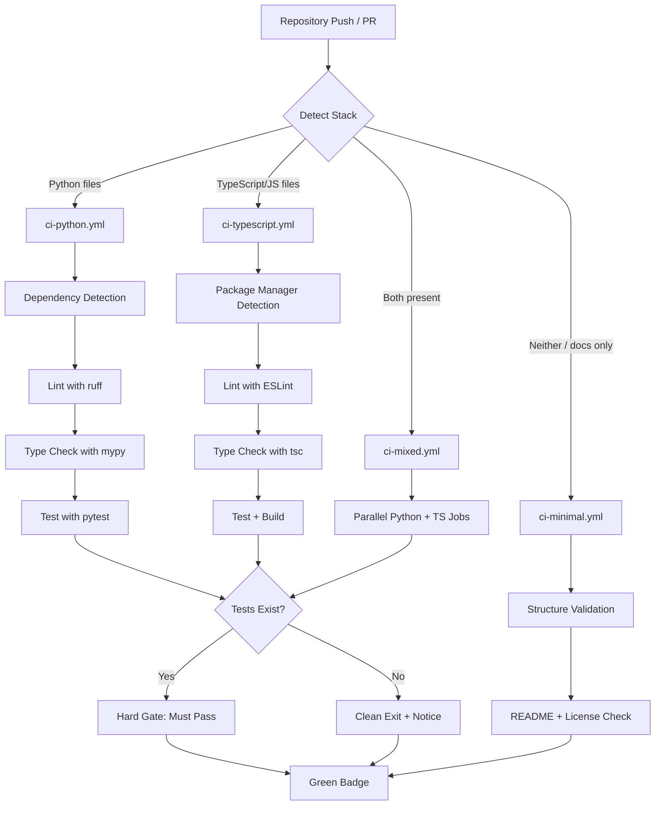
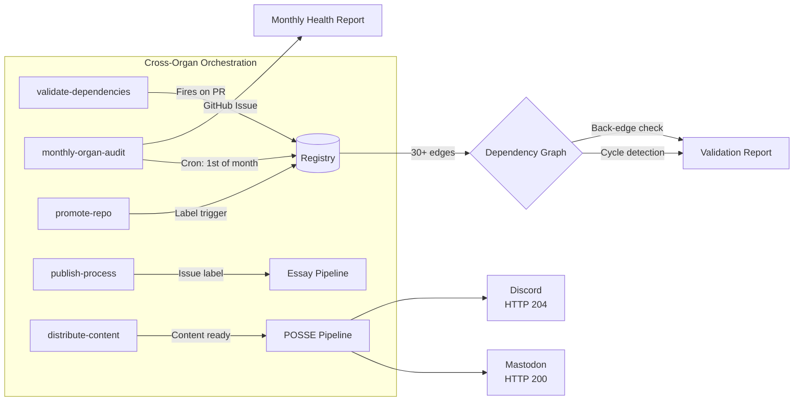

# Testing the Meta-System: CI/CD Across Eight Organs

## The Question Nobody Asks

There is a standard question that any engineer encountering a multi-repository system will ask: "How do you test it?" The question assumes a familiar context. There is code. There are tests. You run the tests. They pass or they fail. Green means safe. Red means broken. The mental model is straightforward because most CI/CD systems exist in environments where "the thing being tested" is unambiguous — it is source code, and the tests exercise that code[^1].

The eight-organ system breaks this assumption. Of the 78 repositories distributed across 8 GitHub organizations, only about 30 contain substantial executable code. Eight more have skeleton implementations — enough structure to prove a concept but not enough to constitute a production system. The remaining roughly 40 are README-only: documentation repositories, planning corpuses, essay collections, template libraries, community infrastructure with no runtime component. When someone asks "how do you test it?" the honest answer is: it depends entirely on what you mean by "it."

The conventional CI/CD model was designed for code repositories. It runs linters, type checkers, test suites, and build steps. It produces coverage reports and binary pass/fail outcomes. It was not designed for a system where the primary deliverable is 270,000 words of documentation, where the central artifact is a JSON registry that tracks 80 entries across 8 organizations, where quality is measured by the Stranger Test ("Would a grant reviewer seeing this for the first time be convinced?") rather than by test coverage percentages[^2]. And yet the system must still be tested. Documentation can be wrong. Links can break. Dependencies can violate the constitutional prohibition on back-edges. Registry entries can fall out of sync with reality. The meta-system has failure modes, and failure modes require validation.

This essay describes the CI/CD architecture that emerged from that realization — a system of four workflow templates (ci-python, ci-typescript, ci-mixed, ci-minimal), five orchestration workflows, and a philosophy of graceful degradation that redefines what "green" means for a creative-institutional system[^3].

---

## What Green Means When Half Your Repos Have No Code

In a traditional software project, "green" means all tests pass. The CI badge at the top of the README is a binary signal: the software works as specified, or it does not. This model collapses when you are testing a system that includes epistemological frameworks, generative art engines, SaaS products with 2,055 tests, essay collections, community infrastructure, and template libraries — all under the same governance umbrella[^4].

The eight-organ system has repositories at radically different points on the code-to-documentation spectrum. At one extreme sits `public-record-data-scrapper` in ORGAN-III (Ergon), a production deployment with 60+ collection agents, Terraform infrastructure, tiered subscriptions, and 2,055 tests covering collection, parsing, storage, API, and integration layers. At the other extreme sits `public-process` in ORGAN-V (Logos), a Jekyll-based essay collection with no executable code beyond the static site generator itself — its "tests" are whether the markdown renders correctly, whether the RSS feed validates, and whether the cross-references to other essays resolve.

Between these extremes lies the full diversity of creative infrastructure. `recursive-engine--generative-entity` in ORGAN-I (Theoria) has 1,254 tests and 85% coverage — serious, production-grade validation of a symbolic processing system. `agentic-titan` in ORGAN-IV (Taxis) has 1,095+ tests spanning adversarial, chaos, end-to-end, integration, performance, MCP, and Ray categories. But `example-generative-music` in ORGAN-II (Poiesis) has a skeleton implementation — enough code to demonstrate a concept but no comprehensive test suite. `salon-archive` in ORGAN-VI (Koinonia) is community infrastructure that tracks transcripts and metadata. `announcement-templates` in ORGAN-VII (Kerygma) is a template library. What does "green" mean for a template library?

The answer I arrived at is that "green" is not a universal condition. It is a tier-specific guarantee. A flagship repository with 2,055 tests must pass all of them. A skeleton repository with no tests must pass structural validation — does the README exist, does it meet word count thresholds, do the links resolve. A documentation-only repository must pass link auditing and registry consistency checks. Green does not mean the same thing everywhere. It means the repository meets the quality standard appropriate to its tier and content[^5].

<figure>
<table>
<thead><tr><th>Repo Tier</th><th>CI Template</th><th>What "Green" Means</th><th>Hard Gates</th></tr></thead>
<tbody>
<tr><td>Flagship (production)</td><td>ci-python / ci-typescript</td><td>All tests pass, coverage tracked</td><td>Test suite, build step</td></tr>
<tr><td>Standard (implemented)</td><td>ci-python / ci-typescript / ci-mixed</td><td>Tests pass, lint/type warnings surfaced</td><td>Test suite (if present)</td></tr>
<tr><td>Skeleton (prototype)</td><td>ci-minimal or stack-specific</td><td>Structure valid, README exists</td><td>None (informational only)</td></tr>
<tr><td>Documentation-only</td><td>ci-minimal</td><td>README present, license present, links valid</td><td>None (structural checks)</td></tr>
<tr><td>Archived</td><td>ci-minimal</td><td>Archive banner present, no active development</td><td>None</td></tr>
</tbody>
</table>
<figcaption>Table 1. Tier-specific quality definitions — what "green" guarantees at each maturity level.</figcaption>
</figure>

This is not a compromise. It is a design decision. A system that applies the same CI criteria to `public-record-data-scrapper` (production SaaS with paying subscribers) and `reading-group-curriculum` (community reading list with no code) would produce one of two outcomes: either the documentation repos would be held to meaningless standards (100% test coverage of zero tests is a useless metric), or the production repos would be held to insufficient standards (structural validation alone is not enough for software that handles financial data). Tier-specific green avoids both failures[^6].

---

## The Four CI Templates

The Platinum Sprint introduced four CI workflow templates designed to cover every repository type in the eight-organ system. Each template is stored in the planning corpus at `templates/ci-workflows/` and deployed to repositories based on their primary technology stack. The templates share a common philosophy: detect the environment, attempt every reasonable check, and degrade gracefully when a check is not applicable.

### ci-python.yml

The Python template targets ORGAN-I's theoretical frameworks and ORGAN-III's Python-based products. It runs on push and pull request against main, master, and develop branches. The workflow uses a matrix strategy testing against Python 3.11 and 3.12, caches pip dependencies, and executes a four-stage pipeline: dependency detection, linting with ruff, type checking with mypy, and testing with pytest.

The dependency detection step is the first expression of graceful degradation. The template does not assume a particular dependency format — it checks for `pyproject.toml`, `requirements.txt`, and `setup.py` in that order, and installs accordingly. If none exists, the workflow continues without installing project dependencies. This matters because ORGAN-I repositories range from fully packaged Python projects with pyproject.toml configurations to single-file theoretical scripts with no dependency management at all[^7].

The linting and type-checking steps both use `continue-on-error: true`. This is a deliberate choice that many CI purists would reject. In a typical production workflow, a linting failure should block the build. In the eight-organ system, enforcing lint compliance across 17 ORGAN-I theory repos — some of which were written as exploratory research code, not production software — would create more noise than signal. The lint step surfaces issues as GitHub warnings without blocking the pipeline. The type-check step does the same. This is not permissiveness. It is pragmatism about the difference between a SaaS product with paying customers and an epistemological research script that formalizes alchemical transformation processes.

The pytest step is the only hard gate. If tests exist and pytest is installed, they must pass. If no tests directory exists, the step exits cleanly with a notice annotation. This handles the full spectrum: `recursive-engine--generative-entity` runs its 1,254 tests and must pass all of them. `sema-metra--alchemica-mundi` has no test directory and exits cleanly. Both outcomes are green, because green means "this repository meets its own quality standard," not "this repository has tests."

Coverage uploads to Codecov happen conditionally — only when pytest produces a coverage XML file. This means flagship repos with comprehensive test suites get coverage tracking and badge support automatically, while repos without tests do not produce misleading 0% coverage reports.

### ci-typescript.yml

The TypeScript template mirrors the Python template's philosophy for the JavaScript/TypeScript ecosystem. It tests across Node.js 18.x, 20.x, and 22.x, detects the package manager (pnpm, yarn, or npm), runs ESLint, performs TypeScript type checking via `tsc --noEmit`, executes the test suite, and attempts a build step[^8].

The package manager detection is particularly important for the eight-organ system. ORGAN-II (Poiesis) repos use a mix of package managers — `metasystem-master` uses npm, `audio-synthesis-bridge` uses npm, but `client-sdk` was started with yarn. Rather than enforcing a single package manager across all repos (which would require migration work that produces no user-visible value), the template adapts to whatever the repo already uses. The first time the CI runs, it detects the lock file and configures itself accordingly.

Like the Python template, linting and type-checking use `continue-on-error: true`, and the test and build steps degrade gracefully when no test runner or build script is configured. The template handles the full range from `metasystem-master` (comprehensive monorepo with multiple packages, extensive tests, and a production build pipeline) to `client-sdk` (skeleton WebSocket client with minimal implementation).

### ci-mixed.yml

The mixed template handles repositories that contain both Python and TypeScript code — a situation more common in the eight-organ system than in most development environments, because the creative work frequently bridges languages. `agentic-titan` in ORGAN-IV has Python agent implementations alongside TypeScript orchestration tooling. `tab-bookmark-manager` in ORGAN-III has Python ML services behind a TypeScript browser extension.

The template runs two parallel jobs — `test-python` and `test-typescript` — each detecting its respective stack independently. If a repo has Python files but no package.json, only the Python job produces meaningful results; the TypeScript job detects the absence and exits cleanly. This parallel detection means the template can be applied to any mixed-stack repo without configuration, and it will automatically test whatever stacks are present.

### ci-minimal.yml

The minimal template is the most philosophically interesting of the four, because it is designed for repositories that have no traditional code at all. It detects the repository type (Swift, Ruby/Jekyll, Node, Python, or generic), validates structural elements (README existence, license file presence, word count), and performs stack-specific checks where applicable (Jekyll build check for Ruby-detected repos).

This template covers the approximately 40 repositories in the system that are primarily documentation: ORGAN-V essays, ORGAN-VI community infrastructure, ORGAN-VII marketing templates, the archived ORGAN-II monorepo fragments, and the numerous repos across all organs that currently contain only READMEs. For these repositories, "testing" means verifying that the documentation exists, meets minimum quality standards, and contains the structural markers that the system requires[^9].

The minimal template is what makes it possible to put a CI badge on every repository in the system — not as a vanity exercise, but as a visual contract. When a grant reviewer sees a CI badge on a documentation repository, the badge means: this repo has been structurally validated. The README exists. The license is present. The minimum quality standard has been checked automatically. That is a meaningful guarantee, even for a repo with zero executable code.

---

## The Five Orchestration Workflows

Beyond the per-repo CI templates, the eight-organ system runs five cross-organ orchestration workflows from the `orchestration-start-here` repository in ORGAN-IV. These workflows constitute the system's nervous system — they validate relationships between repos, audit organ health, manage promotions, publish essays, and distribute content.

### validate-dependencies

This workflow fires on every pull request that modifies dependency-related files (`.meta/dependencies.json`, `package.json`, `requirements.txt`, `Cargo.toml`). It fetches the central registry, parses the proposed dependency changes, and checks them against the constitutional rules: no back-edges (ORGAN-III cannot depend on ORGAN-II), no circular dependencies, and all declared dependencies must reference repos that actually exist in the registry[^10].

The workflow uses cycle detection and transitive depth analysis — upgraded during Phase 3 to catch not just direct violations but chains of dependencies that, while individually legal, create problematic transitive coupling. The target latency is under two minutes, because this workflow runs in the critical path of every PR that touches dependency files.

During Phase 2 micro-validation, this workflow validated 30 dependency edges across the system and caught one back-edge: `multi-camera--livestream--framework` in ORGAN-III had declared a dependency on an ORGAN-II repo. The dependency was removed, the constitutional rule was enforced, and the validation passed. That single catch justified the entire workflow. Without automated validation, that back-edge would have persisted silently, creating exactly the kind of cascading failure risk that the unidirectional flow rule is designed to prevent.

### monthly-organ-audit

This workflow runs on a cron schedule (first of each month) and performs a comprehensive system health check. It uses `calculate-metrics.py` — one of the three Python scripts in the orchestration repo — to compute per-organ and system-wide metrics: repository counts, documentation completeness, dependency health, promotion status distribution, and tier distribution[^11].

The audit produces a GitHub issue (issue #1 was the first automated test run) that contains a structured report. This report serves dual purposes: it catches regressions (a repo whose documentation status has been downgraded, a new dependency that violates the rules) and it generates an institutional record. Over time, the monthly audit issues form a time series of system health — visible to any reviewer who navigates to the orchestration-start-here repo.

The audit takes approximately 15 minutes because it must read the full registry, query each organization's repository list via the GitHub API, and cross-reference the results. This is the most expensive workflow in the system, but it runs monthly, not per-PR.

### promote-repo

The promotion workflow automates the state machine defined in Article VI of the constitution: LOCAL to CANDIDATE to PUBLIC_PROCESS to GRADUATED to ARCHIVED. When a repository receives a specific label (`ready-for-promotion`) and a triggering comment, the workflow validates the promotion criteria against the registry, checks that the documentation meets the target tier's quality standard, and — if all checks pass — updates the registry and creates a notification issue in the destination organ.

This workflow includes automated registry validation added during Phase 3. It does not blindly trust the promotion request. It verifies: does the repo exist in the registry? Is it at the correct current state for the requested transition? Does it meet the documentation requirements for the target state? Does the proposed promotion respect the dependency rules? Only after all checks pass does the promotion proceed.

### publish-process and distribute-content

These two workflows handle the ORGAN-V publication pipeline and ORGAN-VII POSSE distribution, respectively. `publish-process` triggers when an issue in ORGAN-III (or any organ generating public-process content) receives a specific label. It extracts the README or essay content and scaffolds a new essay entry in the `public-process` repo. `distribute-content` triggers when ORGAN-V content is ready for distribution and pushes it to Mastodon (verified HTTP 200) and Discord (verified HTTP 204) via the POSSE pipeline.

---

## Graceful Degradation as Design Philosophy

The phrase that appears most frequently in the CI templates is `continue-on-error: true`. This is not laziness. It is the encoding of a specific design philosophy: graceful degradation[^12].

Graceful degradation means that each step in the pipeline attempts its check, reports its findings, and allows the pipeline to continue regardless of the outcome — unless the check is a hard gate (test execution). This philosophy emerges from a practical observation about the eight-organ system: strict CI enforcement optimized for a single production codebase produces pathological outcomes when applied to a heterogeneous creative infrastructure.

Consider what happens without graceful degradation. A new contributor pushes a change to `example-choreographic-interface` in ORGAN-II. The CI runs. ESLint fails because the skeleton implementation uses `var` instead of `const` in a prototype file written during an exploratory session. The type checker fails because the prototype does not have complete type annotations. The build step fails because the build script references a dependency that was not installed. The pipeline is red across the board. The contributor, who was trying to fix a typo in the README, sees three failures and assumes the repo is broken. The maintainer — me — sees three failures and must triage each one to determine whether the change actually broke anything. In practice, it broke nothing. The prototype was always in that state. The CI is surfacing pre-existing conditions as if they were regressions.

With graceful degradation, the same scenario plays out differently. ESLint runs and surfaces warnings in the GitHub annotations. The type checker runs and surfaces warnings. The build step runs and reports that no build script is configured. All of these are informational. The test step (the hard gate) finds no tests and exits cleanly. The pipeline is green. The contributor sees that the change did not break anything — because it did not. The maintainer sees the warnings and can address them when the skeleton implementation matures into a full implementation. Pre-existing conditions are visible but not blocking.

This approach requires trust in the tier system. If `public-record-data-scrapper` — a production SaaS with paying subscribers — had the same graceful degradation for its lint and type-check steps, that would be inappropriate. Production code should enforce lint compliance. But `public-record-data-scrapper` is a flagship with its own bespoke CI configuration that enforces strict standards. The templates are for the remaining repositories — the standards, stubs, skeletons, and documentation repos — where strict enforcement would produce noise without value[^13].

The phrase I keep coming back to is: the CI should match the maturity of the code. A skeleton repo gets skeleton CI. A production repo gets production CI. A documentation repo gets documentation CI. The templates encode this principle by detecting what is present and testing only what exists, rather than demanding what is absent.

---

## Testing Documentation at Scale

The most unconventional aspect of the eight-organ CI strategy is the treatment of documentation as a testable artifact. In the conventional software world, documentation is not tested — it is written, maybe spell-checked, and published. But documentation at the scale of 270,000 words across 72 documented repositories creates failure modes that are indistinguishable from code bugs in their impact[^14].

During Phase 2 micro-validation, the V1 link audit scanned 1,267 links across 66 READMEs. Seven broken system links were found and fixed — six of them in ORGAN-I READMEs that had been patched via the GitHub API during the Silver Sprint. Four external links failed due to transient issues (etceter4.com, shadertoy.com, activitywatch.net, vite-plugin-monkey). The V2 TBD scan checked all 66 READMEs for unresolved placeholder markers (TBD, TODO, placeholder) and found 12 matches — all false positives (contextual uses in technical descriptions, not actual unresolved markers).

<figure>

1,267

Links Scanned

66

READMEs Audited

7

Broken Links Fixed

0

Real TBD Markers

<figcaption>Figure 1. Phase 2 micro-validation results — documentation tested as rigorously as code.</figcaption>
</figure>

These are real bugs. A broken link in a README that a Knight Foundation reviewer follows is functionally equivalent to a broken endpoint in an API. The reviewer cannot access the content. The experience degrades. The portfolio credibility diminishes. The difference between a link audit and a unit test is aesthetic, not substantive — both verify that a system behaves as specified.

The V3 registry reconciliation checked that all 67 repos on GitHub had corresponding registry entries and that their documentation status matched reality. It found that `meta-organvm/.github` was missing from the registry (added), and that 40 description mismatches existed between the registry's enhanced descriptions and the actual GitHub descriptions (synced during Phase 3 Tier 1). The V4 dependency validation checked all 30 dependency edges against the constitutional rules and confirmed zero violations (after the one back-edge fix). The V5 constitution gates verified the system against all four quality gates (Registry, Portfolio, Dependency, Completeness). The V6 organ checks verified all 8 organs individually.

These validation scripts — `v1-v2-link-tbd-audit.py`, `v3-registry-reconciliation.py`, `v4-dependency-validation.py`, `v5-v6-constitution-organ-checks.py` — are the CI of the meta-system. They do not test code. They test the institutional integrity of a creative infrastructure. The fact that they exist, run, and pass is itself evidence of production-ready thinking — the kind of thinking that hiring managers at AI labs and grant reviewers at foundations are trained to recognize.

---

## Cross-Organ Integration Testing

The most complex testing challenge in the eight-organ system is not testing individual repos. It is testing the relationships between them. The registry declares 31 dependency edges (after the Gap-Fill Sprint added one more). Each edge represents a claim: this repo depends on that repo. The claim must be validated not just structurally (does the target repo exist?) but semantically (does the dependency make sense? does it respect the unidirectional flow?)[^15].

The `validate-deps.py` script in the orchestration repo performs this validation. It loads the registry, builds the dependency graph, checks for cycles (none found), checks for back-edges (one found and fixed during Phase 2), and verifies that every target repo actually exists in the registry. It also computes transitive depth — the longest chain of dependencies from any entry point. This matters because a deep transitive chain creates implicit coupling even when every individual edge is legal.

The integration testing also covers cross-org consistency. The monthly audit workflow checks that every org's `.github` repo exists and contains the expected community health files (CONTRIBUTING.md, SECURITY.md, CODE_OF_CONDUCT.md). It verifies that the org profile README exists and meets the minimum word count. It checks that the org's repo count matches the registry's count. These are not traditional integration tests, but they serve the same function: verifying that the system's components interact correctly.

One unexpected challenge was testing the POSSE distribution pipeline. The `distribute-content.yml` workflow posts to Mastodon and Discord, and during the launch on February 11, it was verified by checking HTTP response codes (Mastodon returned 200, Discord returned 204). But there is no automated test that verifies the content of those posts — that the correct essay was distributed, that the formatting is correct, that the links resolve. This remains a manual verification step, and I am honest about that gap. The system does not pretend to have testing coverage it lacks.

---

## What the Badge Row Means

The Platinum Sprint introduced a standardized badge row for every repository in the system. The template lives at `templates/badges/badge-row.md` and includes six badges: CI status, coverage, license, organ number, repo status, and primary language. The badge row is not decoration. It is a visual contract.

When a reviewer opens a repository and sees the badge row, each badge makes a specific claim:

- **CI badge**: This repository has automated validation. The validation matches the repo's tier and content. Green means the repo meets its own quality standard.
- **Coverage badge**: If present and showing a percentage, this repo has test coverage tracking. If showing "pending," it either has no tests or has not yet been configured for coverage reporting. Both states are honest.
- **License badge**: This repo is licensed. The license type is visible at a glance.
- **Organ badge**: This repo belongs to a specific organ. The organ number and name are visible. A reviewer can immediately understand the repo's domain context.
- **Status badge**: Active, deployed, skeleton, archived. The repo's current state is visible without reading the README.
- **Language badge**: The primary implementation language. Useful for technical reviewers who want to assess competence in specific stacks.

The badge row serves the Stranger Test. A grant reviewer who opens `recursive-engine--generative-entity` and sees `CI: passing | Coverage: 85% | License: MIT | Organ: I Theoria | Status: Active | Language: Python` can form an immediate impression of the repo's quality, context, and maturity — before reading a single word of documentation. That impression is earned, not manufactured. Each badge reflects a real, validated property of the repository.

Crucially, the badge row also serves repos that do not have code. A documentation repo with `CI: passing | Coverage: pending | License: MIT | Organ: V Logos | Status: Active | Language: Markdown` tells the reviewer: this is a documentation project, it has been structurally validated, and it is part of the public process organ. The coverage badge honestly reports "pending" rather than manufacturing a false coverage number. The CI badge means the minimal template has verified structural integrity. Even the absence of data is informative when it is presented honestly.

---

## What Is Next

The current CI/CD architecture covers the full system at a structural level. Every repo can have a CI badge. Every dependency edge is validated. Every link is audited. Every registry entry is reconciled. But there are gaps, and acknowledging them is part of the testing methodology.

The largest gap is semantic validation of documentation content. The link audit catches broken URLs. The TBD scan catches placeholder markers. But nothing currently verifies that a README accurately describes the code it documents. If `recursive-engine--generative-entity` changes its architecture but the README is not updated, the CI will not catch the drift. This is a documentation-code consistency problem that the industry as a whole has not solved, and I am not going to pretend that four YAML templates solve it either.

The second gap is end-to-end testing of the cross-organ workflows. The validate-dependencies workflow is tested by the act of running it against real PRs. The monthly audit is tested by running it on schedule. But there is no staging environment where a simulated promotion can be tested end-to-end without affecting the production registry. Building that staging layer is Phase 4 work — important, but not blocking for the current operational state.

The third gap is performance regression testing across the meta-system. As the registry grows (currently 80 entries, likely to grow as new projects are created), the validation scripts will take longer to run. The monthly audit already takes 15 minutes. At 200 entries, it might take 45 minutes. At 500, it might hit the GitHub Actions timeout. Performance budgets for the validation scripts have not been established, and they should be.

These gaps are documented, not hidden. The CI/CD architecture of the eight-organ system is honest about what it tests, what it does not test, and why. That honesty is itself a form of quality assurance. A system that claims 100% testing coverage of a creative-institutional infrastructure spanning 78 repos and 270,000 words is lying. A system that claims structural validation, dependency integrity, link auditing, and tier-appropriate CI — while acknowledging the gaps in semantic validation, end-to-end workflow testing, and performance regression — is telling the truth.

In the previous essay on building in public (Essay 04), I argued that failure documented is more valuable than success hidden. The same principle applies to testing. Gaps documented are more valuable than gaps denied. The eight-organ system is tested. It is not perfectly tested. The distance between those two statements is where the next phase of work lives.

[^1]: Humble, J. and Farley, D., *Continuous Delivery: Reliable Software Releases through Build, Test, and Deployment Automation*, Addison-Wesley, 2010. The foundational text on CI/CD pipelines assumes code as the primary artifact under test.

[^2]: Deming, W. Edwards, *Out of the Crisis*, MIT Press, 1986. Deming's distinction between inspection-based and process-based quality anticipates the challenge of testing systems where "quality" cannot be reduced to binary pass/fail outcomes.

[^3]: Nygard, Michael T., *Release It! Design and Deploy Production-Ready Software*, 2nd ed., Pragmatic Bookshelf, 2018. Nygard's concept of stability patterns and graceful degradation directly informs the CI template design philosophy.

[^4]: Kim, Gene, et al., *The Phoenix Project: A Novel About IT, DevOps, and Helping Your Business Win*, IT Revolution Press, 2013. The constraints of flow, feedback, and continual learning apply even when the "product" is documentation infrastructure rather than a monolithic application.

[^5]: McConnell, Steve, *Code Complete: A Practical Handbook of Software Construction*, 2nd ed., Microsoft Press, 2004. McConnell's argument that quality practices must scale to the project's context — not be applied uniformly regardless of scope — supports tier-specific CI definitions.

[^6]: Meadows, Donella H., *Thinking in Systems: A Primer*, Chelsea Green Publishing, 2008. The concept of leverage points in systems thinking explains why tier-appropriate testing produces better systemic outcomes than uniform strict enforcement.

[^7]: Fowler, Martin, *Refactoring: Improving the Design of Existing Code*, 2nd ed., Addison-Wesley, 2018. Fowler's principle of incremental improvement applies to CI templates that detect and adapt to the current state of the codebase rather than demanding a target state.

[^8]: Bass, Len, Weber, Ingo, and Zhu, Liming, *DevOps: A Software Architect's Perspective*, Addison-Wesley, 2015. The multi-environment testing strategy across Node.js versions mirrors Bass et al.'s architecture for heterogeneous deployment targets.

[^9]: Martin, Robert C., *Clean Code: A Handbook of Agile Software Craftsmanship*, Prentice Hall, 2008. Martin's argument that code cleanliness is itself a form of communication extends naturally to documentation: if documentation is code for human readers, it should be testable.

[^10]: Brooks, Frederick P., *The Mythical Man-Month: Essays on Software Engineering*, Anniversary ed., Addison-Wesley, 1995 (orig. 1975). Brooks's observation that conceptual integrity requires architectural control applies directly to the dependency validation that prevents back-edges from fragmenting the organ hierarchy.

[^11]: Humble and Farley, *Continuous Delivery*, 2010. The monthly audit operationalizes the "deployment pipeline as information radiator" concept — not just for code releases but for institutional health metrics.

[^12]: Nygard, *Release It!*, 2018. The `continue-on-error: true` pattern is a direct application of Nygard's bulkhead and circuit-breaker patterns adapted from runtime services to CI pipelines.

[^13]: Deming, *Out of the Crisis*, 1986. Deming's warning against "management by numbers alone" applies: enforcing lint metrics on exploratory research code optimizes for a measurable proxy rather than for actual code quality.

[^14]: Knuth, Donald E., "Literate Programming," *The Computer Journal*, vol. 27, no. 2, 1984, pp. 97-111. Knuth's insight that programs should be written for human readers anticipates the treatment of documentation as a first-class testable artifact.

[^15]: Brooks, *The Mythical Man-Month*, 1975. The dependency validation workflow operationalizes Brooks's argument that the integrity of a system depends on the integrity of its interfaces — in this case, the declared dependency edges between organs.
