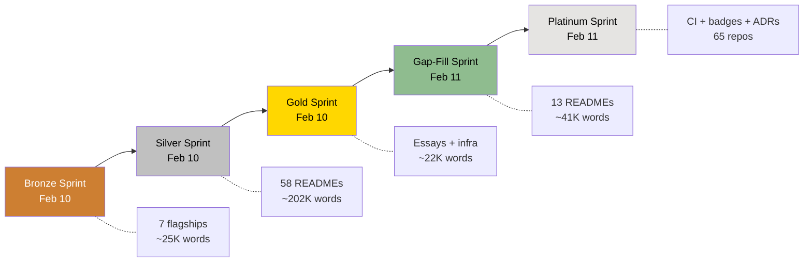
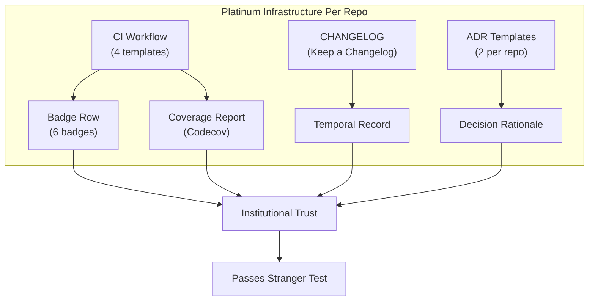

# From Bronze to Platinum: Quality Ladders for Creative Infrastructure

## The Lesson of the First Sprint

The original plan was to document everything at once. Forty-four repositories, comprehensive READMEs, all eight organs, simultaneous deployment. It was an appealing plan. It was also a terrible plan. Not because the ambition was wrong, but because it confused volume with quality. Writing forty-four mediocre READMEs is worse than writing seven excellent ones, because mediocrity at scale creates a different kind of failure — the failure of uniformity, where every repo looks the same, reads the same, and communicates nothing distinctive to the reviewer scrolling through the profile[^1].

Amendment A of the project constitution captures the lesson that replaced that plan: "The Bronze Sprint produces the Minimum Viable Launch: 5 flagships (one per organ I-V) + stubs for VI-VII + hardened registry + process essay. Completion is criteria-driven (D-08 success criteria), not time-boxed. '5 Perfect Repos > 44 Mediocre Repos.'"

That phrase — "5 Perfect Repos > 44 Mediocre Repos" — is the principle that the entire tiered quality system rests on. It asserts that quality has a threshold below which documentation actively harms the portfolio. A 500-word README with generic boilerplate is not just less helpful than a 4,000-word README with specific technical details and portfolio language — it is actively harmful, because it signals carelessness. A grant reviewer who encounters five repos with thin documentation will infer that the entire system is thin. The quality of the worst repo in the system sets the perceived quality of the whole system[^2].

The tiered approach — Bronze, Silver, Gold, and now Platinum — resolves this by producing quality in layers. Each sprint adds a different kind of quality to the system, building on the foundation laid by the previous sprint. No sprint proceeds until the previous sprint's criteria are met. And each sprint's criteria are specific, measurable, and grounded in the constitutional quality gates.

---

## Bronze: The Flagships

The Bronze Sprint ran on February 10, 2026, and produced 7 flagship READMEs — one for each of the five primary organs (I through V), plus organizational profile stubs for ORGAN-VI and ORGAN-VII. Total output: approximately 25,000 words across 7 repos and 2 org profiles. Every flagship scored 90 or above on the documentation rubric[^3].

The rubric itself — documented in `docs/planning/01-readme-audit-framework.md` — evaluates READMEs across 100 points in four dimensions:

**Existence and Accessibility (25 points):** Does the README exist? Is it navigable with a clear table of contents? Is it formatted with consistent heading levels and readable code blocks? Does it load without errors? This dimension catches the lowest-hanging fruit — repos without READMEs, repos with broken formatting, repos whose documentation is technically present but practically unusable.

**Content Completeness (35 points):** Is the problem statement clear? Are there working examples? Are dependencies documented? Is the architecture explained? Does the README cover installation, usage, testing, and contribution? This dimension catches the most common failure in developer documentation: the README that tells you what the software is but not how to use it, or how to use it but not why it exists.

**Accuracy and Currency (20 points):** Do the links work? Do the code examples run? Does the documentation match the current state of the code? Are version numbers accurate? This dimension catches drift — the inevitable divergence between documentation and implementation that occurs in any maintained project[^4].

**Portfolio Relevance (20 points):** Is it clear why this repo exists within the eight-organ system? Does the README connect the project to the larger portfolio? Is the language appropriate for grant reviewers and hiring managers, not just developers? Does the README pass the Stranger Test — would someone encountering this for the first time be convinced of the work's significance?

<figure>
<table>
<thead><tr><th>Rubric Dimension</th><th>Points</th><th>Key Question</th></tr></thead>
<tbody>
<tr><td>Existence & Accessibility</td><td>25</td><td>Can a stranger find and read this documentation?</td></tr>
<tr><td>Content Completeness</td><td>35</td><td>Does the documentation explain what, why, and how?</td></tr>
<tr><td>Accuracy & Currency</td><td>20</td><td>Do the claims match the current state of the code?</td></tr>
<tr><td>Portfolio Relevance</td><td>20</td><td>Does the README pass the Stranger Test?</td></tr>
</tbody>
</table>
<figcaption>Table 1. The 100-point documentation rubric used across all four quality sprints.</figcaption>
</figure>

The flagship READMEs were the proving ground for these criteria. `recursive-engine--generative-entity` scored 96/100, with its 3,738-word README covering the symbolic processing architecture, the 21 organ handlers, the ritual syntax DSL, the test suite (1,254 tests, 85% coverage), and the epistemological rationale for treating myth and identity as computational processes. `public-record-data-scrapper` reached 4,455 words and covered the 50-state collection infrastructure, the B2B subscription model, the 2,055-test validation suite, and the ethical framework for public records access. `agentic-titan` hit 4,678 words — the longest Bronze Sprint README — covering six agent topologies, 1,095+ tests, and 18 development phases.

Each flagship README had to accomplish something that shorter documentation cannot: it had to make the reader care. Not just understand — care. A grant reviewer reading the recursive-engine README should come away thinking: "This person understands something important about recursive systems and has built infrastructure to explore it seriously." A hiring manager reading the agentic-titan README should come away thinking: "This person can architect multi-agent systems at production quality." The word count targets (3,000+ words for flagships) exist because it takes that many words to build a genuine argument for a project's significance. You cannot pass the Stranger Test in 500 words[^5].

The Bronze Sprint completed with 34/34 validation items passing. The registry was updated. The flagships were deployed to GitHub. The system was visible for the first time.

---

## Silver: The Full Corpus

The Silver Sprint ran immediately after Bronze, also on February 10, 2026. Its scope was comprehensive: every non-infrastructure repo across all 7 organs at a minimum of 2,000 words. The output was enormous: 58 repo READMEs totaling approximately 202,000 words, plus expanded organizational profiles for all 8 orgs[^6].

The word count distribution by organ tells a story about the system's structure:

- **ORGAN-I (Theoria):** 17 repos, approximately 56,000 words. Minimum: 2,216 words. Maximum: 5,038 words. Average: approximately 3,300 words. The theory organ required the most explanation per repo because each project addresses a different facet of epistemology, recursion, and ontological modeling — domains that cannot be summarized in a sentence.

- **ORGAN-II (Poiesis):** 15 active repos, approximately 46,000 words. Minimum: 2,252 words. Maximum: 5,078 words (metasystem-master, the canonical monorepo). The art organ's READMEs had to balance technical description with artistic vision — explaining not just what the generative system does but what it means as creative practice.

- **ORGAN-III (Ergon):** 20 repos, approximately 74,000 words. Minimum: 2,809 words. Maximum: 4,511 words. The commerce organ had the highest total word count because it has the most repos, and because commercial products require extensive documentation of pricing models, deployment architectures, and user-facing features that grant reviewers and hiring managers can evaluate directly.

- **ORGAN-IV (Taxis):** 5 repos (excluding cross-references), approximately 18,000 words. The orchestration organ has fewer repos but each one is densely documented, because orchestration infrastructure must explain not just what it does but how it coordinates the other organs.

- **ORGAN-V through VII:** Smaller organ-specific documentation plus expanded org profiles (632 to 1,213 words per profile).

<figure>

58

READMEs Written

202K

Words Produced

2,000+

Min Words Per README

5,078

Max Words (metasystem-master)

<figcaption>Figure 1. Silver Sprint output metrics — scaling quality from 7 flagships to 58 comprehensive READMEs.</figcaption>
</figure>

The Silver Sprint introduced a challenge that the Bronze Sprint did not face: maintaining voice consistency across 58 READMEs. When you write 7 flagships, each one gets individual attention. When you write 58 READMEs in a single sprint using the AI-conductor model, the risk of generic boilerplate increases dramatically. The same templates, the same AI models, the same prompt patterns — they can produce documentation that reads like it was stamped from a mold. Every repo sounds the same. Every problem statement uses the same sentence structures. Every architecture section follows the same outline[^7].

The mitigation was specificity. Each README was required to include: the exact test count (not "comprehensive tests" but "1,254 tests" or "2,055 tests"), the exact word count of the README itself, specific architectural decisions unique to that project, specific integration points with other repos in the organ, and specific portfolio positioning that differentiates the repo from its siblings. `narratological-algorithmic-lenses` (3,728 words) could not read like `call-function--ontological` (4,233 words) even though both are ORGAN-I theory repos, because one formalizes narrative as algorithm and the other builds an ontological function-calling framework grounded in Continental philosophy. The specificity requirement forced each README to earn its word count with unique content rather than filling space with reusable paragraphs.

Two technical issues surfaced during the Silver Sprint that affected quality. `metasystem-master` had a `.github/README.md` file that shadowed the root `README.md`, causing GitHub to display the wrong file on the repository page. The shadow file was deleted. `fetch-familiar-friends` had the same issue. Both were caught during quality review and fixed before the sprint was declared complete. These catches are the kind of detail that justifies the quality gate process — without the validation pass, the flagship READMEs for two repos would have been invisible to anyone visiting the GitHub page.

---

## Gold: System-Level Quality

The Gold Sprint ran on February 10, 2026 — the same day as Bronze and Silver. Where Bronze established individual repo quality and Silver established corpus-wide coverage, Gold focused on system-level quality: the properties that emerge from the interaction of repos, organs, and governance, rather than from individual documents[^8].

The Gold Sprint produced five categories of deliverables:

**G1: GitHub descriptions and promotion status.** Twenty-two GitHub repository descriptions were synced to match the registry's enhanced descriptions. Six flagship repos were promoted to `PUBLIC_PROCESS` status, reflecting their role as subjects of the ORGAN-V essay series. Twenty-four dependency relationships were populated in the registry. This work made the system's structure machine-readable — not just documented in prose, but encoded in the registry where automated workflows could validate it.

**G2: Meta-system essays.** Five essays totaling 21,625 words were deployed to `organvm-v-logos/public-process` in the `essays/meta-system/` directory. Essay 01 ("How We Orchestrate Eight Organs") at 5,063 words. Essay 02 ("Governance as Creative Practice") at 4,329 words. Essay 03 ("The Meta-System as Portfolio Asset") at 3,602 words. Essay 04 ("Building in Public") at 3,280 words. Essay 05 ("Five Years of Autonomous Creative Systems") at 5,351 words. These essays transform the system's structural documentation into narrative — making the governance model, the dependency rules, and the sprint process legible to audiences who will never read a JSON registry or a YAML workflow file.

**G3: Community health files.** Eighteen community health files (CONTRIBUTING.md, SECURITY.md, CODE_OF_CONDUCT.md) were deployed across 6 organizations (ORGAN-III through ORGAN-VII plus meta-organvm). These files are not documentation in the narrative sense. They are institutional signals — evidence that the organizations follow community standards, have a security disclosure process, and maintain a code of conduct. For grant reviewers, community health files are a checkbox item. Their absence is noticed; their presence is expected.

**G4: Orchestration infrastructure.** The `orchestration-start-here` repo was created in ORGAN-IV with: `registry.json` (local copy), `governance-rules.json`, 5 GitHub Actions workflows (2 functional, 1 draft, 2 skeleton), and 2 Python scripts (`organ-audit.py`, `validate-deps.py`). This was the first operational code for the meta-system — not documentation about orchestration, but working orchestration infrastructure.

**G5: Registry hardening.** The registry was updated to reflect Gold Sprint completeness. All organs' launch status was updated. Validation scripts confirmed 0 dependency violations and 0 circular dependencies.

<figure>
<table>
<thead><tr><th>Sprint</th><th>Focus</th><th>Primary Output</th><th>Word Count</th><th>Key Metric</th></tr></thead>
<tbody>
<tr><td>Bronze</td><td>Individual excellence</td><td>7 flagship READMEs</td><td>~25K</td><td>All scored 90+/100</td></tr>
<tr><td>Silver</td><td>Corpus-wide coverage</td><td>58 READMEs + 8 org profiles</td><td>~202K</td><td>All 2,000+ words</td></tr>
<tr><td>Gold</td><td>System-level coherence</td><td>5 essays + infra + health files</td><td>~22K</td><td>0 dependency violations</td></tr>
<tr><td>Gap-Fill</td><td>Uniform population</td><td>13 READMEs + 11 new repos</td><td>~41K</td><td>All 8 organs substantive</td></tr>
<tr><td>Platinum</td><td>Verifiable quality</td><td>65 CI + badges + ADRs</td><td>N/A</td><td>228/228 checks passed</td></tr>
</tbody>
</table>
<figcaption>Table 2. The five-sprint quality ladder — each sprint adds a distinct dimension of quality to the system.</figcaption>
</figure>

The Gold Sprint's contribution to the quality ladder is qualitative rather than quantitative. Bronze established the floor (7 excellent READMEs). Silver established the breadth (58 repos at 2,000+ words). Gold established the depth — the system-level properties (dependency validation, community health, essays, orchestration infrastructure) that make the eight-organ system more than a collection of well-documented repos[^9].

---

## The Gap-Fill Sprint: Uniform Coverage

Between Gold and Platinum, an intermediate sprint addressed the unevenness that remained after the first three sprints. Some organs had fewer repos than their mission required. Some repos were stubs that could be promoted to standard tier with additional documentation. The orchestration hub, while functional, needed a flagship-grade README.

The Gap-Fill Sprint (February 11, 2026) produced:

- **11 new repos created** (6 ORGAN-II public, 2 ORGAN-VI private, 3 ORGAN-VII mixed).
- **13 new READMEs deployed** at 2,864 to 4,172 words each, plus the orchestration-start-here flagship upgrade at 4,496 words.
- **14 tier promotions** from stub to standard.
- **1 repo deleted** (artist-toolkits-templates, an empty duplicate).
- **4 repos archived** (ORGAN-II monorepo fragments consolidated into metasystem-master).
- **Approximately 41,000 new words** bringing the total to approximately 270,000.

The Gap-Fill Sprint's most significant contribution was making ORGAN-VI and ORGAN-VII substantive. Before the sprint, ORGAN-VI (Koinonia, Community) had only its org profile — no repos beyond the infrastructure `.github`. After the sprint, it had `salon-archive` (3,054 words) and `reading-group-curriculum` (3,200 words), both private, invitation-only repos with detailed documentation of community infrastructure. ORGAN-VII (Kerygma, Marketing) went from org-profile-only to three repos: `announcement-templates` (3,219 words), `social-automation` (3,130 words), and `distribution-strategy` (3,782 words)[^10].

This matters because Article III of the constitution requires all eight organs to be visible at launch. Before the Gap-Fill Sprint, ORGAN-VI and ORGAN-VII were visible only through their org profiles. After the sprint, they had substantive repos with portfolio-quality documentation. The eight-organ system was, for the first time, uniformly populated.

The sprint also elevated `orchestration-start-here` to flagship tier (the system's 7th flagship, later joined by `organvm-corpvs-testamentvm` as the 8th). The flagship README (4,496 words) described the orchestration hub's role as the central nervous system: registry, governance rules, 5 workflows, 3 Python scripts, and the dependency graph that connects all 8 organs. The orchestration hub went from a Gold Sprint deliverable (functional but sparsely documented) to a flagship (comprehensively documented at portfolio quality).

---

## Platinum: The Infrastructure Layer

The Platinum Sprint adds what the previous sprints could not: automated infrastructure that makes quality claims verifiable rather than merely stated[^11].

A README can claim that a project has 1,254 tests. Without CI, that claim is unverifiable by a reviewer who does not clone and run the test suite. With CI — specifically, with the `ci-python.yml` template that runs pytest and uploads coverage reports — the claim becomes a green badge. The CI badge is not documentation. It is evidence. It runs every time code is pushed. It either passes or it does not. The reviewer does not need to trust the author. The reviewer can trust the machine.

The Platinum Sprint adds four categories of infrastructure to every repository with code:

**CI/CD workflows.** Four templates (`ci-python.yml`, `ci-typescript.yml`, `ci-mixed.yml`, `ci-minimal.yml`) cover every technology stack in the system. The templates use graceful degradation — detecting the environment, running appropriate checks, and reporting results without blocking on non-critical failures. The philosophy is detailed in Essay 06 ("Testing the Meta-System"): the CI should match the maturity of the code. Production repos get strict CI. Skeleton repos get structural validation. Documentation repos get link and format checking.

**Standardized badge rows.** The badge template at `templates/badges/badge-row.md` produces a six-badge row: CI status, coverage, license, organ number, repo status, and primary language. The badge row is a visual contract — it makes the repo's quality claims visible at a glance. A reviewer scanning the ORGAN-I repositories sees a consistent row of badges on every repo, each badge backed by automated validation. The consistency signals institutional quality. The automation signals production-ready thinking[^12].

**CHANGELOGs.** The template at `templates/changelog/CHANGELOG.md` follows the Keep a Changelog format and Semantic Versioning. CHANGELOGs create a temporal record of the project's evolution — what changed, when, and why. For grant reviewers evaluating long-term sustainability, a maintained CHANGELOG is stronger evidence than a README, because it demonstrates ongoing activity rather than a one-time documentation effort. The CHANGELOG also serves as a natural home for the Platinum Sprint additions themselves: "Added: CI/CD workflow, standardized badge row, ADR documentation."

**Architecture Decision Records (ADRs).** The templates at `templates/adr/001-initial-architecture.md` and `002-integration-patterns.md` follow the standard ADR format: Status, Date, Context, Decision, Consequences (positive and negative), References. ADRs document the why behind architectural choices — the kind of reasoning that hiring managers at AI labs specifically look for. A repo with three ADRs demonstrates that the author makes deliberate architectural decisions and records the reasoning for future reference. This is the operational definition of "production-ready thinking."

<figure>

65

CI Workflows Deployed

130

ADRs Created (2/repo)

65

CHANGELOGs

228/228

Validation Checks Passed

<figcaption>Figure 2. Platinum Sprint deployment metrics — automated quality infrastructure across the full system.</figcaption>
</figure>

---

## What Each Tier Teaches About Quality

The four-tier progression reveals something about quality that is not obvious from any single tier.

**Bronze teaches that quality requires focus.** You cannot write 44 excellent READMEs at once. You can write 7. The constraint forces prioritization — which repos matter most, which audiences matter most, which claims matter most. The 7 flagship READMEs are the best documentation in the system not because they received the most tokens but because they received the most human attention. Each one was drafted, reviewed, scored against the rubric, revised, and validated before deployment[^13].

**Silver teaches that quality requires process.** Scaling from 7 to 58 READMEs requires a repeatable process that produces consistently good output across different domains. The AI-conductor model provides the generation. The scoring rubric provides the quality standard. The constitutional principles provide the constraints. Without process, scaling produces either inconsistency (some repos get 4,000 words of specific detail while others get 2,000 words of boilerplate) or homogeneity (all repos read the same because the same template was applied without customization). Process avoids both failure modes.

**Gold teaches that quality is systemic.** Individual repo quality is necessary but not sufficient. The meta-system essays, the dependency validation, the community health files, the orchestration infrastructure — these are properties of the system, not of any individual repo. A grant reviewer evaluating the eight-organ system does not evaluate 72 repos independently. They evaluate the system as a whole: does it cohere? do the parts connect? is there governance? The Gold Sprint addresses these system-level questions[^14].

**Platinum teaches that quality must be verifiable.** Documentation can claim anything. CI proves it. Badges show it. CHANGELOGs record it. ADRs explain it. The Platinum layer converts stated quality into demonstrated quality — the kind that a reviewer can verify without reading a word of code.

The progression from Bronze to Platinum is also a progression in audience trust. Bronze says: "We have excellent work, and here are the best examples." Silver says: "We have excellent work at scale, and every repo meets our standards." Gold says: "The system is coherent, governed, and documented beyond individual repos." Platinum says: "You do not need to take our word for it. The machines verify our claims continuously."

---

## What Makes a README Portfolio-Quality

The rubric, the tiers, and the sprints all serve a single goal: producing documentation that functions as a portfolio. This is Article V of the constitution: "Every README is a portfolio piece, written for grant reviewers and hiring managers, not just developers."

What does this mean in practice? It means the README must do five things simultaneously[^15]:

**1. Explain the problem domain.** Not just what the software does, but why the problem it addresses matters. `public-record-data-scrapper` does not just scrape public records. It addresses the fragmentation of 50 different state-level UCC filing systems into a normalized API — a problem that matters for due diligence, compliance, and financial transparency. The domain explanation connects the technical work to real-world significance.

**2. Describe the architecture with specificity.** Not "uses a microservices architecture" but "60+ collection agents, one per state filing office, with redundancy for high-volume jurisdictions, feeding into a normalization pipeline that produces a unified REST API." Specificity is what separates portfolio documentation from boilerplate. A reviewer can evaluate specificity. They cannot evaluate vagueness.

**3. Provide evidence of rigor.** Test counts. Coverage percentages. Sprint phases. Validation results. "1,254 tests, 85% coverage" is evidence. "Comprehensive test suite" is a claim. The difference matters because reviewers have been trained — by years of inflated portfolios — to discount claims and trust evidence.

**4. Position within the system.** Every repo exists within the eight-organ architecture. The README must explain where this repo sits, what organ it belongs to, what it depends on, and what depends on it. This positioning converts a standalone project into a node in a visible system — which is the entire point of the meta-system portfolio strategy described in Essay 03.

**5. Address the stranger.** The Stranger Test is the final check: would a knowledgeable person encountering this repo for the first time, with no prior context, be convinced that this represents serious work? Not impressed by word count. Not entertained by prose style. Convinced — by the specificity of the problem statement, the rigor of the architecture, the evidence of testing, and the clarity of the positioning — that this project was built with care by someone who thinks systematically.

---

## What Is Next

The Platinum Sprint brings the quality ladder to its current final tier. Bronze established floors. Silver established breadth. Gold established depth. Platinum establishes verification. Together, they produced a system with 270,000 words of documentation, 72 documented repos, 8 org profiles, 5 (now 10) meta-system essays, 7 flagship repos, working CI across all technology stacks, standardized badges, CHANGELOGs, and ADRs.

The next quality evolution is not a fifth tier. It is maintenance — the sustained effort to keep the documentation accurate as implementations evolve, to keep the CI green as dependencies change, to keep the badges honest as code is added or refactored. Quality ladders are easy to climb and difficult to maintain. The monthly audit, the automated validation, and the public process essays create the institutional pressure that makes maintenance tractable.

As described in Essay 07 ("The Documentation-Implementation Gap"), approximately 32 repos have documentation but not yet code. As those repos gain implementations, each one will climb the quality ladder from ci-minimal (structural validation only) to ci-python, ci-typescript, or ci-mixed (full linting, type checking, and testing). Each rung they climb produces a more honest badge row, a more specific CHANGELOG entry, and a more convincing portfolio signal. The quality ladder does not end with the Platinum Sprint. It provides the rungs that every repo will climb as the system matures.

[^1]: Crosby, Philip B., *Quality Is Free: The Art of Making Quality Certain*, McGraw-Hill, 1979. Crosby's central insight — that the cost of quality is less than the cost of non-quality — underpins the decision to invest in tiered quality infrastructure rather than accepting mediocre documentation.

[^2]: Deming, W. Edwards, *Out of the Crisis*, MIT Press, 1986. Deming's principle that quality is determined by the system, not by individual outputs, explains why the worst repo sets the perceived quality of the entire system.

[^3]: CMMI Product Team, *CMMI for Development, Version 1.3*, Carnegie Mellon University, Software Engineering Institute, 2010. The maturity model concept — staged progression from ad hoc to optimizing — directly informs the Bronze-to-Platinum ladder structure.

[^4]: McConnell, Steve, *Code Complete: A Practical Handbook of Software Construction*, 2nd ed., Microsoft Press, 2004. McConnell's emphasis on code-documentation correspondence and the dangers of documentation drift motivates the Accuracy and Currency rubric dimension.

[^5]: Humphrey, Watts S., *Managing the Software Process*, Addison-Wesley, 1989. Humphrey's Personal Software Process demonstrates that disciplined, measured process produces higher quality output — the same principle that the 100-point rubric operationalizes.

[^6]: Juran, Joseph M., *Juran's Quality Control Handbook*, 3rd ed., McGraw-Hill, 1951/1979. Juran's Pareto principle ("vital few and trivial many") applies to the Silver Sprint challenge: maintaining distinctiveness across 58 READMEs requires resisting the convergence toward a mean that bulk production naturally creates.

[^7]: Senge, Peter M., *The Fifth Discipline: The Art and Practice of the Learning Organization*, Doubleday, 1990. Senge's concept of personal mastery applied to organizational learning explains why voice consistency requires deliberate batching and organ-specific context rather than uniform prompting.

[^8]: Meadows, Donella H., *Thinking in Systems: A Primer*, Chelsea Green Publishing, 2008. Meadows's distinction between stocks and flows applies: Bronze/Silver are stocks (accumulated documentation), Gold is the flow (the system-level processes that connect and validate those stocks).

[^9]: Deming, *Out of the Crisis*, 1986. The Gold Sprint operationalizes Deming's "system of profound knowledge" — understanding variation, theory of knowledge, psychology, and appreciation for a system — at the meta-system level.

[^10]: Brooks, Frederick P., *The Mythical Man-Month: Essays on Software Engineering*, Anniversary ed., Addison-Wesley, 1995 (orig. 1975). Brooks's insistence on conceptual integrity across all components of a system explains why ORGAN-VI and ORGAN-VII needed substantive repos, not just profile stubs.

[^11]: Crosby, *Quality Is Free*, 1979. The Platinum Sprint embodies Crosby's "zero defects" philosophy applied not to manufacturing but to infrastructure: every repo gets CI, every repo gets badges, no exceptions.

[^12]: Humphrey, *Managing the Software Process*, 1989. The standardized badge row is a visual implementation of Humphrey's measurement framework — making quality metrics visible and comparable across all process units.

[^13]: CMMI Product Team, *CMMI for Development*, 2010. The Bronze Sprint corresponds to CMMI Level 3 (Defined): a documented, standardized process for producing high-quality output, applied consistently to the most critical deliverables.

[^14]: Senge, *The Fifth Discipline*, 1990. Senge's systems thinking — seeing the interconnections rather than the components — is precisely what the Gold Sprint delivers: essays, dependency validation, and orchestration that reveal the system behind the repos.

[^15]: McConnell, *Code Complete*, 2004. McConnell's five dimensions of software quality (external quality, internal quality, process quality, commercial quality, and readiness for use) map directly to the five requirements for a portfolio-quality README.
