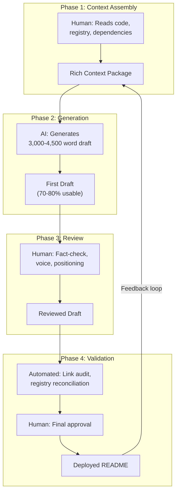
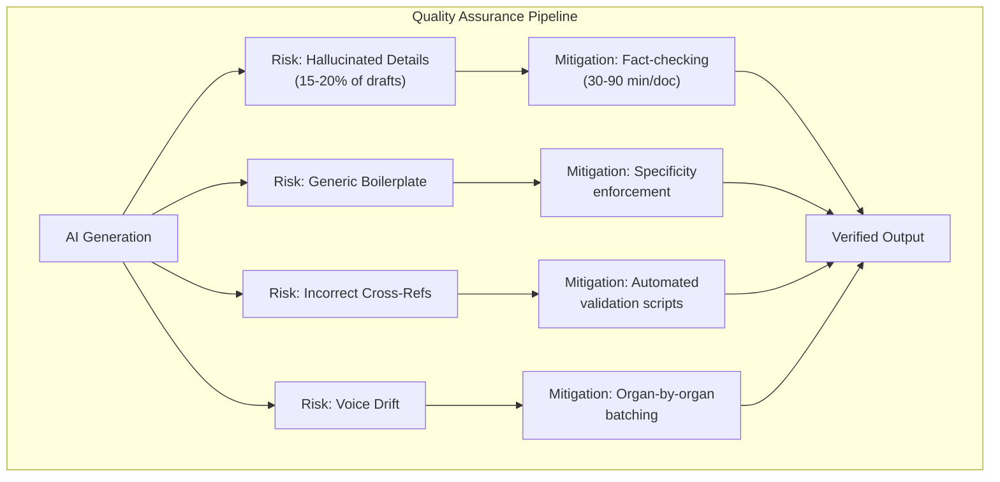

# AI-Conductor Methodology: Directing 270,000 Words of Documentation

## The Claim That Needs Explaining

Between February 10 and February 11, 2026, the eight-organ system produced approximately 270,000 words of documentation across 72 repository READMEs, 8 organizational profiles, 5 meta-system essays, and an orchestration hub flagship. The Bronze Sprint wrote 7 flagship READMEs averaging 4,000+ words each. The Silver Sprint wrote 58 more READMEs averaging 3,000+ words. The Gold Sprint added 5 essays totaling 21,625 words, community health files, and orchestration infrastructure. The Gap-Fill Sprint contributed 13 more READMEs and the orchestration flagship upgrade. In total, the documentation sprint that populated the entire eight-organ system took approximately 48 hours[^1].

This claim sounds implausible. A professional technical writer producing 3,000 words of high-quality documentation per day — a generous estimate — would need approximately 90 working days to produce 270,000 words. That is about four and a half months of full-time writing. The organvm system did it in two days.

The explanation is the AI-conductor model: AI generates volume, human directs strategy and ensures accuracy. This is not a euphemism for "AI wrote everything." It is a specific workflow with defined roles, quality gates, failure modes, and economics. This essay describes that workflow in detail — not to impress, but to be transparent about a methodology that any serious evaluation of the eight-organ system must understand. If a grant reviewer or hiring manager cannot see how 270,000 words were produced, they cannot evaluate whether those words are trustworthy. And trust, not word count, is the portfolio asset[^2].

---

## The Workflow in Practice

The AI-conductor model has four phases: context assembly, generation, review, and validation. Each phase has a specific role assignment — what the human does and what the AI does — and specific quality criteria that must be met before advancing to the next phase.

### Phase 1: Context Assembly (Human-Led)

The human assembles the context that the AI will need to generate accurate documentation. For a repo README, this means:

- The repository's actual code (if it exists), including directory structure, key modules, test suites, and configuration files.
- The registry entry for the repo: name, org, status, dependencies, tier, portfolio relevance.
- The organ's mission statement and documentation standards.
- The constitutional principles and quality gates.
- Cross-references to related repos in the same organ or in dependent organs.
- Specific details that the AI cannot infer: test counts, coverage percentages, deployment URLs, revenue status, architectural decisions that are not evident from the code alone.

Context assembly is the most important phase because it determines the ceiling of the output quality. An AI given thin context produces thin documentation — generic boilerplate about "leveraging cutting-edge technologies" and "scalable architectures." An AI given rich context — specific test counts, real architectural decisions, actual deployment details, concrete dependency relationships — produces documentation that reads like it was written by someone who understands the project. The difference is not in the AI's capability. It is in the human's preparation[^3].

For the Silver Sprint, context assembly for each repo took approximately 15-30 minutes. Read the code (if present). Read the registry entry. Identify the specific details that make this repo unique. Formulate the positioning — how does this repo contribute to the organ, and how does the organ contribute to the system? The 58 Silver Sprint READMEs required approximately 20-30 hours of context assembly across all repos. This is where the human expertise lives: not in the writing, but in the understanding.

### Phase 2: Generation (AI-Led)

The AI generates the first draft. The generation prompt includes: the assembled context, the quality standards (word count targets, rubric criteria, portfolio language expectations), the template structure (problem statement, architecture, usage, testing, positioning, cross-references), and specific instructions about what to include and what to avoid[^4].

A single generation pass — system prompt, context, template, output — consumes approximately 15,000-20,000 tokens. The output is typically 3,000-4,500 words of structured documentation. Generation takes seconds to minutes, depending on the model and the context length.

The raw generation is never the final product. It is a first draft that contains approximately 70-80% usable content and 20-30% material that needs revision: overstatements, imprecise technical descriptions, incorrect cross-references, generic phrasing that could describe any project, and occasionally fabricated details that the AI hallucinated from pattern-matching rather than from the provided context.

<figure>
<table>
<thead><tr><th>Phase</th><th>Led By</th><th>Time Per README</th><th>Key Output</th></tr></thead>
<tbody>
<tr><td>1. Context Assembly</td><td>Human</td><td>15-30 min</td><td>Rich context package with specific details</td></tr>
<tr><td>2. Generation</td><td>AI</td><td>Seconds to minutes</td><td>3,000-4,500 word first draft</td></tr>
<tr><td>3. Review</td><td>Human</td><td>30-90 min</td><td>Fact-checked, voice-corrected draft</td></tr>
<tr><td>4. Validation</td><td>Automated + Human</td><td>5-15 min</td><td>Link-audited, registry-reconciled final</td></tr>
</tbody>
</table>
<figcaption>Table 1. The four-phase AI-conductor workflow — human expertise bookends AI generation capacity.</figcaption>
</figure>

### Phase 3: Review (Human-Led)

The human reviews the generated draft for:

- **Factual accuracy.** Does the README correctly describe the code? Are the test counts right? Are the dependency relationships correct? Are the architectural claims supported by the actual implementation? This is the most critical review task because the AI will confidently state things that are wrong[^5].

- **Voice consistency.** Does the README sound like it was written by the same person who wrote the other READMEs in the system? The AI tends toward a certain corporate neutrality — competent but impersonal. The organvm READMEs aim for a different register: precise, analytical, specific, and occasionally willing to explain why something matters rather than just what it does. The human review adjusts the voice.

- **Portfolio positioning.** Does the README connect the project to the eight-organ system in a way that serves the portfolio strategy? Is the positioning appropriate for the repo's tier and audience? A flagship README needs explicit connections to grant funding criteria and hiring evaluations. A standard README needs clear positioning within its organ but does not need the full portfolio apparatus.

- **Cross-reference integrity.** Are the links to other repos correct? Do the dependency claims match the registry? Does the README reference the correct organ, the correct organization name, the correct repo names?

Review for a Silver Sprint README takes approximately 30-45 minutes. Flagship READMEs (Bronze Sprint) took 60-90 minutes because the quality standard is higher and the portfolio positioning must be precise.

### Phase 4: Validation (Automated + Human)

After review, the README passes through the quality gates:

- **Registry Gate:** Is the registry entry updated to reflect the new documentation status?
- **Portfolio Gate:** Does the README pass the Stranger Test? Score >= 90/100 for flagships, >= 75/100 for standards.
- **Dependency Gate:** Do the cross-references respect the unidirectional flow (I to II to III, no back-edges)?
- **Completeness Gate:** Zero TBD markers. Zero broken links. No placeholder content.

The automated validation scripts — `v1-v2-link-tbd-audit.py`, `v3-registry-reconciliation.py`, `v4-dependency-validation.py` — run after each sprint to check the entire corpus. These scripts caught 7 broken links during Phase 2, one back-edge dependency violation, and 40 description mismatches between the registry and GitHub[^6].

---

## Token Economics

The AI-conductor model makes documentation production economical by measuring effort in tokens rather than human-hours. The TE (Tokens-Expended) budget model quantifies the cost of every deliverable type[^7].

### Per-Task Token Budgets

| Task | TE Budget | Human Time | Explanation |
|------|-----------|------------|-------------|
| README REWRITE (flagship) | ~72,000 TE | 60-90 min review | Complete rewrite of existing README to portfolio quality |
| README REVISE (standard) | ~50,000 TE | 30-45 min review | Revision of existing README to meet quality standards |
| README POPULATE (new) | ~88,000 TE | 45-60 min review | New README for repo with minimal existing documentation |
| README EVALUATE | ~24,000 TE | 15-20 min review | Rubric scoring and gap analysis |
| README ARCHIVE | ~12,000 TE | 10 min review | Archive banner and redirect |
| Essay (4,000-5,000 words) | ~120,000 TE | 90-120 min review | Meta-system essay with full context and cross-references |
| Validation Pass (per repo) | ~15,000 TE | 5-10 min review | Link audit, TBD scan, registry check |
| GitHub Actions Workflow | ~55,000 TE | 30-45 min review | Workflow YAML + Python helper scripts |

### The Arithmetic

A single generation pass (system prompt + context + template + output) consumes approximately 15,000-20,000 tokens. But documentation is not produced in a single pass. Each README goes through 2-3 revision iterations: the initial generation, a revision pass incorporating review feedback, and a final validation pass. With context and system prompt overhead at each iteration, a typical README costs 50,000-90,000 tokens in total AI processing[^8].

At current API pricing (as of February 2026), 50,000 tokens costs approximately $1-3 depending on the model and the input/output ratio. That means a 3,000-word portfolio-quality README costs a few dollars in API fees plus 30-60 minutes of human review time. Compare this to the alternative: a professional technical writer at $75-150/hour would charge $375-$750 for a 3,000-word document of equivalent quality, assuming a full day of work including research, drafting, and revision.

<figure>

~6.5M

Total Tokens Expended

$60-175

Silver Sprint API Cost

30-40 hrs

Human Review Time

270K

Words Produced

<figcaption>Figure 1. Token economics of the AI-conductor model — the cost structure that makes documentation-first development economically rational.</figcaption>
</figure>

The economics become even more dramatic at scale. The Silver Sprint — 58 READMEs, approximately 202,000 words — consumed roughly 4.5 million tokens in AI processing. At $1-3 per README, the total API cost was approximately $60-175. The human review time was approximately 30-40 hours across all 58 repos. A traditional technical writing team producing the same output would have needed approximately 60-90 writer-days, costing $36,000-$108,000 at professional rates.

This is the fundamental economic insight of the AI-conductor model: the bottleneck shifts from production to review. Writing 270,000 words is no longer the expensive part. Reviewing 270,000 words for accuracy, voice, and positioning is. The human contribution is not in generating prose — it is in ensuring that the generated prose is true, specific, and strategically positioned[^9].

### Phase Budgets

The implementation plan estimated phase-level budgets:

| Phase | TE Budget | Calendar |
|-------|-----------|----------|
| Phase 1 (Documentation: Bronze + Silver + Gold) | ~4.4M TE | Sprint 1-2 |
| Phase 2 (Micro-Validation) | ~1.0M TE | Sprint 3 |
| Phase 3 (Integration) | ~1.1M TE | Sprint 4 |
| **Total** | **~6.5M TE** | **Criteria-driven** |

The actual expenditure was close to these estimates, though the compressed timeline (all phases completed in approximately 48 hours rather than the originally envisioned multi-week sprint cycle) meant that the human review was intensive. The TE budget was accurate as a measure of AI processing. The human time was underestimated — not because the review was more work per document than expected, but because 48 hours of continuous review is qualitatively different from 4 weeks of distributed review.

---

## The Risks and How They Manifest

Amendment D of the constitution — the AI Non-Determinism Acknowledgment — states: "Same inputs produce different strategic outputs across AI models and across time. All AI-generated deliverables require human review." This amendment exists because the risks of AI-generated documentation are real, specific, and potentially damaging to the portfolio[^10].

### Risk 1: Hallucinated Details

AI models generate text by predicting likely continuations. When the context is thin or the requested detail is specific, the model will sometimes fabricate plausible-sounding but incorrect details: test counts that do not match the actual test suite, architectural descriptions that do not match the actual code, dependency relationships that do not exist in the registry, deployment URLs that resolve to nothing.

During the Silver Sprint, hallucinated details appeared in approximately 15-20% of generated drafts. The most common category was inflated test counts — the AI would see that a project had tests and extrapolate to a specific number that sounded reasonable but was not verified. The second most common was fabricated integration details — the AI would describe how two repos interact based on their names and descriptions rather than on their actual code, producing technically plausible but factually incorrect cross-references.

The mitigation is the review phase. Every number in every README was checked against the actual repo. Every dependency claim was checked against the registry. Every architectural description was checked against the code (where code exists). This is why human review time per document is 30-90 minutes rather than 5 minutes. The review is not proofreading. It is fact-checking[^11].

### Risk 2: Generic Boilerplate

AI models default to patterns they have seen frequently in training data. For technical documentation, this means: "leveraging cutting-edge technologies," "scalable and maintainable architecture," "comprehensive test suite," "modern best practices." These phrases are the equivalent of white noise. They add word count without adding information. A reviewer reading boilerplate learns nothing about the specific project.

The boilerplate risk increases with scale. When generating 58 READMEs in a single sprint, the same AI model processing similar prompts will produce similar prose. The 17th ORGAN-I README starts to sound like the 3rd. The 12th ORGAN-III README uses the same sentence structures as the 1st. Without active intervention, the corpus converges toward a mean — competent but indistinguishable[^12].

The mitigation is specificity enforcement. Each README review checks for: specific numbers (not "many tests" but "1,254 tests"), specific architectural decisions (not "microservices" but "21 organ handlers, each corresponding to a distinct processing domain"), specific positioning (not "part of the theory organ" but "addresses the relationship between Aristotelian four causes and AI function-calling through a 12-concept philosophical architecture"). Boilerplate is replaced with detail. If the detail does not exist — if the repo genuinely does not have specific numbers to cite — then the README acknowledges that honestly rather than filling the gap with vague claims.

### Risk 3: Incorrect Cross-References

The eight-organ system has 80 registry entries across 8 organizations. Each README must correctly reference its own organ, its dependencies, and related repos. The AI, generating from context, will sometimes reference repos that do not exist, use incorrect organization names, or create dependency links that violate the constitutional rules.

During Phase 2 validation, the V4 dependency check found one back-edge: `multi-camera--livestream--framework` in ORGAN-III had been assigned a dependency on an ORGAN-II repo, violating the I-to-II-to-III unidirectional flow rule. This was caught by the automated validation script and corrected before launch. Without automated cross-reference checking, this violation would have persisted in the registry — a structural error introduced by AI generation and missed by human review.

The mitigation is layered: human review catches obvious cross-reference errors, and automated validation scripts catch structural violations. Neither alone is sufficient. Together, they caught every error that made it into the deployed corpus.

### Risk 4: Voice Drift

Over a long generation session (58 READMEs in a single sprint), the AI's output voice can drift — becoming more formulaic, more repetitive, or more detached from the project-specific tone that the early READMEs established. The first 5 READMEs in a sprint tend to be the most distinctive, because the human is actively shaping the voice through detailed prompts and feedback. By README 40, the generation-review cycle has become routine, and the human attention to voice diminishes[^13].

The mitigation is batching. Rather than generating all 58 READMEs in a single session, the Silver Sprint was organized by organ. All ORGAN-I repos were generated together (with ORGAN-I-specific context and voice), then ORGAN-II, then ORGAN-III. This organ-by-organ batching meant that voice drift was contained within each batch rather than accumulating across the full corpus. The voice of ORGAN-I READMEs (precise, theoretical, epistemological) is distinct from ORGAN-III READMEs (commercial, user-facing, metric-oriented) because each organ was generated with its own voice direction.

---

## Quality Assurance at Scale

The quality assurance process for 270,000 words of AI-generated documentation operates at three levels: per-document review, per-sprint validation, and system-wide auditing.

### Per-Document Review

Every README and essay goes through human review before deployment. The reviewer checks factual accuracy, voice consistency, portfolio positioning, cross-reference integrity, and rubric compliance. The review is documented — not in a separate tracking system, but in the registry itself. The `last_validated` field in each registry entry records when the document was last reviewed and validated.

For flagship READMEs, the review includes rubric scoring. The audit framework (`docs/planning/01-readme-audit-framework.md`) produces a numerical score across four dimensions (existence/accessibility, content completeness, accuracy/currency, portfolio relevance). Flagships must score 90+ out of 100. `recursive-engine--generative-entity` scored 96. `agentic-titan` scored in the low 90s. These scores are specific, not aspirational — they reflect actual evaluation against defined criteria.

### Per-Sprint Validation

After each sprint completes, the automated validation scripts run across the full corpus:

- **V1 Link Audit:** Scans all READMEs for links and verifies each one resolves. The Silver Sprint produced 1,267 links across 66 READMEs. Seven broken system links were found and fixed. Four external links failed due to transient issues (etceter4.com, shadertoy.com, activitywatch.net, vite-plugin-monkey) — these were noted but not treated as failures because they are outside the system's control.

- **V2 TBD Scan:** Checks all READMEs for unresolved placeholder markers (TBD, TODO, placeholder). Found 12 matches, all false positives — contextual uses of these words in technical descriptions, not actual unresolved markers.

- **V3 Registry Reconciliation:** Verifies that every repo on GitHub has a corresponding registry entry, and that the documentation status field matches reality. Found one missing entry (`meta-organvm/.github`) and 40 description mismatches (cosmetic — the registry has enhanced descriptions).

- **V4 Dependency Validation:** Checks all dependency edges for cycles, back-edges, and references to non-existent repos. Found one back-edge violation (fixed).

- **V5 Constitution Gates:** Runs all four quality gates (Registry, Portfolio, Dependency, Completeness) against the full system. All passed after fixes.

- **V6 Organ Checks:** Verifies each organ individually — repo counts, documentation completeness, profile status. All 8 organs passed[^14].

### System-Wide Auditing

The monthly organ audit workflow (`monthly-organ-audit.yml`) runs on the first of each month and produces a comprehensive health report. This creates a time series of system quality — not just a snapshot at launch, but an ongoing record that tracks drift, regression, and improvement.

The audit checks metrics that per-sprint validation does not: is the documentation still accurate after code changes? Have new repos been added to GitHub that are missing from the registry? Have dependency relationships changed in ways that were not reflected in the registry? These are the slow-moving quality issues that only become visible over time, and the monthly audit is designed to surface them before they accumulate.

---

## What This Model Does Not Do

The AI-conductor model does not write code. The 270,000 words are documentation — READMEs, essays, profiles, governance files. The code in the system (1,254 tests in recursive-engine, 2,055 tests in public-record-data-scrapper, 1,095+ tests in agentic-titan) was written by a human developer over years of sustained effort. The AI-conductor model accelerated the documentation of that code, not the creation of it.

The model also does not replace human judgment about strategy, positioning, or quality. The AI cannot determine which repos should be flagships. It cannot decide that "5 Perfect Repos > 44 Mediocre Repos." It cannot resolve the tension between comprehensive documentation and honest accounting of the documentation-implementation gap (described in Essay 07). It cannot position the system for Knight Foundation funding differently than for Anthropic hiring. These are human decisions that the AI assists in executing, not in making.

The model does not guarantee accuracy. Amendment D of the constitution exists because AI-generated content requires verification. Every number, every cross-reference, every architectural claim must be checked. The human review time (30-90 hours across the full documentation sprint) is the cost of that verification. Removing the verification would save time and destroy trust.

And the model does not produce creative insight. The meta-system essays (the one you are reading right now included) are structured by human thinking — the argument about documentation-implementation gaps, the analysis of tiered quality systems, the reflection on five years of autonomous creative practice. The AI executes the structure, generates the prose, fills in the details. The human provides the ideas, the structure, the argument, and the voice. The conductor analogy is precise: the orchestra produces the sound, but the conductor shapes the interpretation[^15].

---

## Replicability

The AI-conductor model is not proprietary. It is a workflow that anyone can adopt, and its replicability is part of its value as a portfolio asset. The components are:

1. **A registry or inventory** of what needs to be documented. `registry-v2.json` serves this role for the organvm system.
2. **A quality rubric** that defines what "good" documentation looks like. `01-readme-audit-framework.md` serves this role.
3. **Templates** that structure the generation. The constitutional principles, the README template (problem statement, architecture, usage, testing, positioning), and the portfolio positioning guidelines.
4. **Access to a capable AI model** that can generate 3,000-5,000 words of structured documentation from rich context.
5. **Human expertise** in the domain being documented — not writing expertise, but domain expertise. The human must know enough about the project to verify the AI's output and catch its errors.
6. **Automated validation** that checks the output for structural correctness: link integrity, cross-reference accuracy, registry consistency, dependency compliance.

Any practitioner with these components can produce documentation at a similar rate. The eight-organ system is one configuration. The methodology is general.

The broader implication is that the traditional barrier to portfolio-quality documentation — the sheer labor of writing it — has been largely removed. The remaining barriers are: the domain expertise to assemble context and verify output, the strategic thinking to position documentation for specific audiences, and the discipline to run validation at scale. These are human capabilities. The AI provides the prose. The human provides the judgment.

---

## What Is Next

The AI-conductor model will continue to evolve as the system matures. The immediate next application is the Platinum Sprint documentation: ADRs for every repo with architectural decisions worth recording, CHANGELOGs for every repo with a development history worth tracking, and updated READMEs for repos whose implementations have advanced since the Silver Sprint.

Beyond the Platinum Sprint, the model faces a new challenge: maintenance. Producing 270,000 words of documentation in 48 hours is impressive. Keeping 270,000 words of documentation accurate as 78 repositories evolve over months and years is a different kind of problem. The AI-conductor model addresses the production bottleneck. The maintenance bottleneck requires something else: automated drift detection that flags when a README's claims no longer match the code, combined with efficient regeneration that updates only the sections that have changed.

This is the next frontier for the methodology. Not generating documentation from scratch — that problem is solved. But maintaining documentation at scale — detecting drift, regenerating sections, re-validating cross-references, re-running the quality gates — across a system that will grow beyond 78 repos. The monthly audit provides the detection. The AI-conductor model provides the regeneration capacity. The validation scripts provide the verification. The missing piece is the glue that connects drift detection to automated regeneration to human review approval. That glue is the next deliverable.

For now, the claim stands: 270,000 words, portfolio quality, 48 hours, token economics that make it economically rational, quality assurance that makes it trustworthy, and an honest accounting of the risks that makes it credible. The AI-conductor model is not magic. It is a workflow. And the workflow works.

[^1]: Brynjolfsson, Erik and McAfee, Andrew, *The Second Machine Age: Work, Progress, and Prosperity in a Time of Brilliant Technologies*, W. W. Norton, 2014. The productivity multiplier described here — 90 writer-days compressed to 48 hours — exemplifies what Brynjolfsson and McAfee call "bounty": the ability of digital technologies to amplify human output.

[^2]: Shneiderman, Ben, *Human-Centered AI*, Oxford University Press, 2022. Shneiderman's framework for trustworthy AI systems emphasizes transparency about methodology as a prerequisite for user trust — precisely the motivation for this essay's detailed workflow disclosure.

[^3]: Engelbart, Douglas C., "Augmenting Human Intellect: A Conceptual Framework," SRI Summary Report AFOSR-3223, 1962. Engelbart's vision of augmenting rather than automating human capability maps directly to the context assembly phase: the human provides the understanding, the AI provides the expression.

[^4]: Licklider, J. C. R., "Man-Computer Symbiosis," *IRE Transactions on Human Factors in Electronics*, vol. HFE-1, 1960, pp. 4-11. The AI-conductor workflow operationalizes Licklider's symbiosis concept: the human formulates the problem and evaluates the output, the computer handles the combinatorial generation.

[^5]: Kahneman, Daniel, *Thinking, Fast and Slow*, Farrar, Straus and Giroux, 2011. The review phase addresses Kahneman's System 1/System 2 distinction: AI generation operates like System 1 (fast, pattern-based, prone to confident errors), while human review provides System 2 (slow, deliberate, fact-checking) oversight.

[^6]: Schon, Donald A., *The Reflective Practitioner: How Professionals Think in Action*, Basic Books, 1983. The validation phase embodies Schon's "reflection-in-action" — not just producing output but systematically examining the output for quality, accuracy, and alignment with professional standards.

[^7]: Brynjolfsson and McAfee, *The Second Machine Age*, 2014. The token economics quantify the "bounty" in precise terms: $60-175 in API costs versus $36,000-$108,000 in traditional writing costs for equivalent output.

[^8]: Floridi, Luciano, *The Ethics of Artificial Intelligence: Principles, Challenges, and Opportunities*, Oxford University Press, 2023. Floridi's framework for responsible AI deployment emphasizes the importance of human oversight proportional to the stakes — the 30-90 minutes of review per document represents this proportional oversight.

[^9]: Csikszentmihalyi, Mihaly, *Creativity: Flow and the Psychology of Discovery and Invention*, Harper Perennial, 1996. The shift from production to review as the bottleneck reconfigures the creative process: the human's flow state occurs during context assembly and review (where creative judgment is exercised), not during prose generation.

[^10]: Shneiderman, *Human-Centered AI*, 2022. Amendment D of the constitution implements what Shneiderman calls "reliable, safe, and trustworthy" AI deployment: acknowledging non-determinism and mandating human review as institutional policy.

[^11]: Kahneman, *Thinking, Fast and Slow*, 2011. The 15-20% hallucination rate in generated drafts is a manifestation of what Kahneman calls the "illusion of validity" — the AI produces outputs with high confidence that do not correspond to verified reality.

[^12]: Bourdieu, Pierre, *The Field of Cultural Production: Essays on Art and Literature*, Columbia University Press, 1993. Bourdieu's concept of "distinction" applies to the boilerplate problem: generic documentation positions the author within a mass of indistinguishable practitioners, while specific documentation creates distinction within the field.

[^13]: Csikszentmihalyi, *Creativity*, 1996. Voice drift across 58 READMEs is a creative fatigue phenomenon — the kind of quality degradation that Csikszentmihalyi identifies when sustained creative work exceeds the practitioner's attentional capacity.

[^14]: Schon, *The Reflective Practitioner*, 1983. The three-level quality assurance process (per-document, per-sprint, system-wide) implements Schon's hierarchy of reflection: reflection-in-action (during review), reflection-on-action (after sprint), and organizational reflection (monthly audit).

[^15]: Brooks, Frederick P., *The Mythical Man-Month: Essays on Software Engineering*, Anniversary ed., Addison-Wesley, 1995 (orig. 1975). Brooks's observation that the hardest part of building software is deciding what to build — not the building itself — maps precisely to the AI-conductor model: the hard part is context assembly and review (human), not generation (AI).
